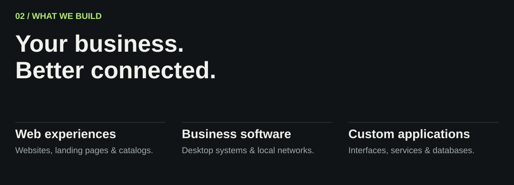
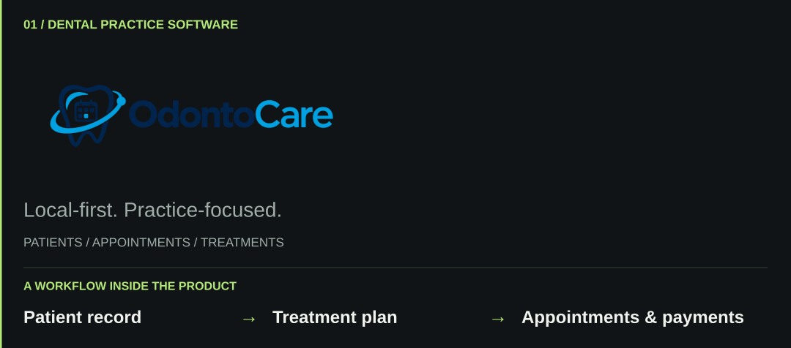
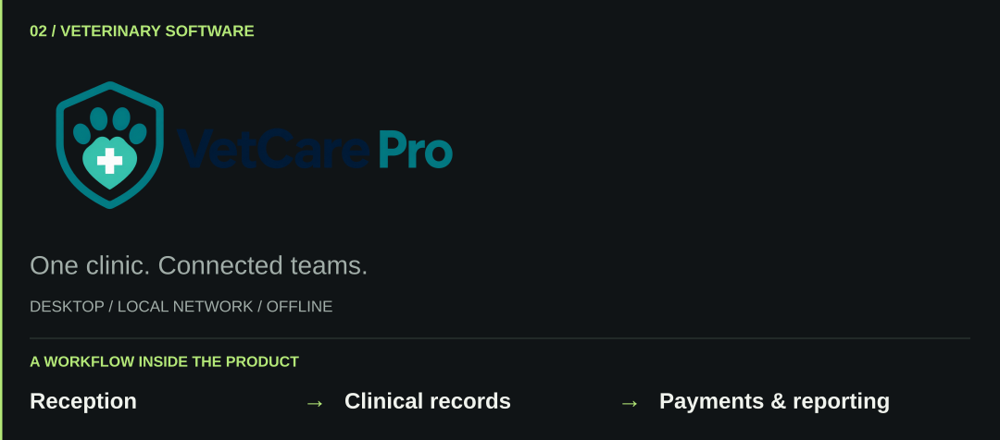
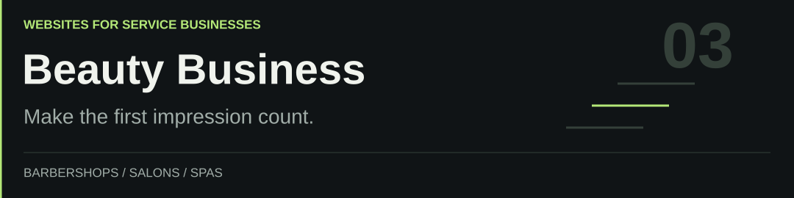
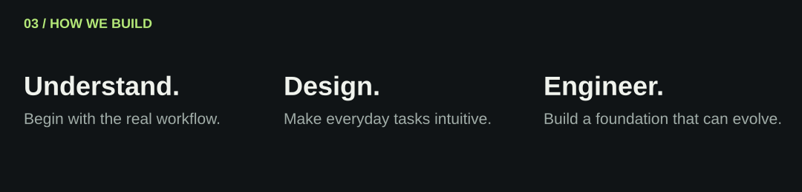
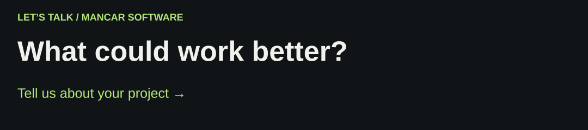

<picture>
  <source media="(prefers-reduced-motion: reduce)" srcset="profile/assets/mancar-header-static.png" />
  
</picture>

<strong>Websites, applications, and business systems for the way you work.</strong> We bring product design and software engineering together for businesses and SMEs.

[Selected work](#selected-work) &nbsp; / &nbsp; [Our toolkit](#our-toolkit) &nbsp; / &nbsp; [Let’s talk](https://www.instagram.com/mancarsoftware/)

<picture>
  <source media="(max-width: 600px)" srcset="profile/assets/mancar-capabilities-mobile.svg" />
  
</picture>

## Selected work

<a href="https://github.com/MancarSoftware/odonto_care">
<picture>
  <source media="(max-width: 600px)" srcset="profile/assets/project-odontocare-mobile.svg" />
  
</picture>
</a>

Patient records, appointments, treatments, and payments in a Windows application that works offline.

[Explore OdontoCare →](https://github.com/MancarSoftware/odonto_care)

<a href="https://github.com/MancarSoftware/vetCarePro">
<picture>
  <source media="(max-width: 600px)" srcset="profile/assets/project-vetcare-mobile.svg" />
  
</picture>
</a>

Veterinary software for a single PC or a connected clinic, with records and payments available over the local network.

[Explore VetCare Pro →](https://github.com/MancarSoftware/vetCarePro)

<a href="https://github.com/MancarSoftware/beauty-business-template">
<picture>
  <source media="(max-width: 600px)" srcset="profile/assets/project-beauty-mobile.svg" />
  
</picture>
</a>

Adaptable websites for barbershops, salons, and spas, with service listings, galleries, and contact sections.

[Explore Beauty Business →](https://github.com/MancarSoftware/beauty-business-template)

<picture>
  <source media="(max-width: 600px)" srcset="profile/assets/mancar-approach-mobile.svg" />
  
</picture>

## Our toolkit

**Interface** &nbsp; React · TypeScript · Tailwind CSS 
**Application** &nbsp; Node.js · NestJS · Electron 
**Foundation** &nbsp; PostgreSQL · Prisma · Docker · Git

<a href="https://www.instagram.com/mancarsoftware/">
<picture>
  <source media="(max-width: 600px)" srcset="profile/assets/mancar-contact-mobile.svg" />
  
</picture>
</a>

[Start a conversation →](https://www.instagram.com/mancarsoftware/) &nbsp; / &nbsp; [Browse our repositories](https://github.com/MancarSoftware?tab=repositories)

MANCAR SOFTWARE · Designed for people. Engineered for business.
