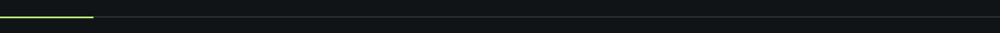

<picture>
  <source media="(prefers-reduced-motion: reduce)" srcset="profile/assets/mancar-header-static.png" />
  
</picture>

# Software that fits the way you work.

Mancar Software designs and develops digital products for businesses: from the website that introduces your company to the systems your team uses every day.

**Thoughtful design. Practical software. Built to evolve.**

[Explore our work](#selected-work) · [Our approach](#how-we-build) · [Start a conversation](https://www.instagram.com/mancarsoftware/)

 

## From your first impression to your daily operations.

**Websites & digital experiences** 
Corporate websites, landing pages, and catalogs that make your business easy to understand and easy to choose.

**Business systems & desktop software** 
Applications shaped around real workflows, with local and networked solutions where the work calls for them.

**Web applications & custom development** 
Interfaces, services, and databases brought together to solve the needs specific to your business.

<picture><source media="(prefers-reduced-motion: reduce)" srcset="profile/assets/mancar-divider.svg" /></picture>

## Selected work

Software for the people behind the business.

### 01 — OdontoCare

**A dental practice, connected.**

A Windows desktop application for dental clinics, bringing patient records, appointments, treatments, payments, and inventory into a local system that works offline.

`Desktop application` · `React · TypeScript · NestJS · PostgreSQL`

[Explore OdontoCare →](https://github.com/MancarSoftware/odonto_care)

 

### 02 — VetCare Pro

**One clinic. A shared view of the work.**

Veterinary desktop software for Windows, supporting a single computer or a local network. Clinical records, appointments, and payments stay accessible across the clinic without depending on an internet connection.

`Desktop & LAN application` · `Electron · Node.js · PostgreSQL`

[Explore VetCare Pro →](https://github.com/MancarSoftware/vetCarePro)

 

### 03 — Beauty Business

**A web presence built around the service.**

A reusable website foundation for barbershops, salons, spas, and beauty businesses. Adaptable service listings, galleries, and contact sections give each business room for its own identity.

`Business websites` · `React · JavaScript · Tailwind CSS`

[Explore Beauty Business →](https://github.com/MancarSoftware/beauty-business-template)

 

[Browse our repositories →](https://github.com/MancarSoftware?tab=repositories)

## How we build

**Start with the business.** Understand the people, the workflow, and the problem before choosing the tools.

**Design for everyday use.** Clear navigation, useful feedback, and accessible interfaces are part of engineering quality.

**Keep the architecture purposeful.** Favor readable code, clear responsibilities, and foundations that can evolve without unnecessary complexity.

**Care about the handover.** Test critical workflows and make installation, operation, and maintenance part of the delivery.

## Our toolkit

Selected to serve the product. Grounded in the work above.

**Interfaces** — React, TypeScript, JavaScript, Tailwind CSS 
**Applications** — Node.js, NestJS, Electron 
**Data & development** — PostgreSQL, Prisma, Docker, Git

---

## What should your software make easier?

Tell us about your business, the people who will use the product, and the problem you want to solve. We welcome project conversations and technical collaborations.

**[Talk to Mancar Software →](https://www.instagram.com/mancarsoftware/)**

 

MANCAR SOFTWARE · Clear interfaces. Solid foundations.
