

<picture>
  <source media="(prefers-reduced-motion: reduce) and (max-width: 600px)" srcset="profile/assets/es/mancar-studio-cover-mobile.png" />
  <source media="(prefers-reduced-motion: reduce)" srcset="profile/assets/es/mancar-studio-cover.png" />
  <source media="(max-width: 600px)" srcset="profile/assets/es/mancar-studio-cover-mobile.gif" />
  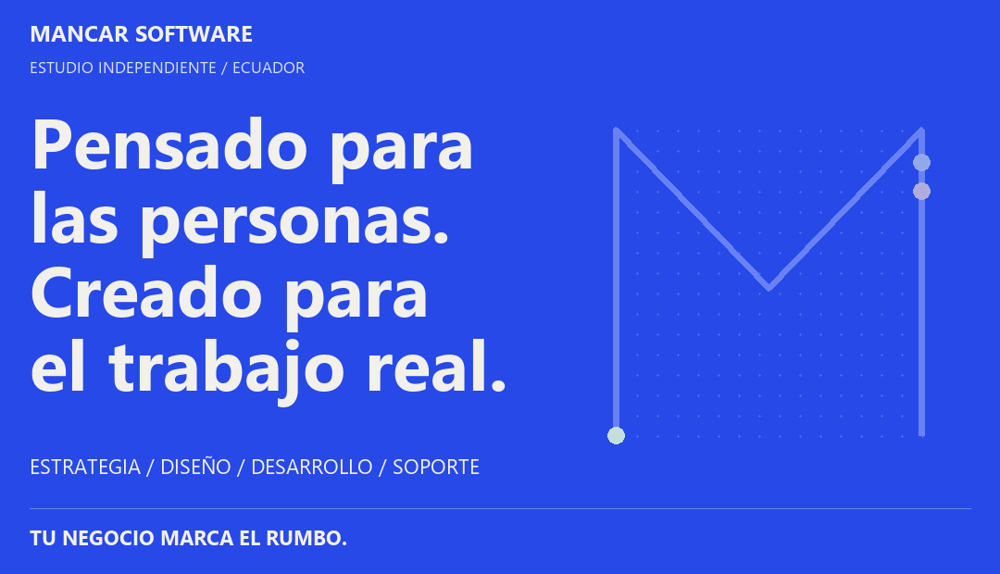
</picture>

# Mancar Software

Unimos estrategia, diseño y desarrollo para ayudar a los negocios a generar confianza, simplificar el trabajo diario y prepararse para lo que viene. Desde Guayaquil, Ecuador, colaboramos directamente con quienes impulsan cada negocio, desde la primera conversación hasta el lanzamiento y el soporte continuo.

## Proyectos destacados

### 01 / OdontoCare

<a href="https://github.com/MancarSoftware/odonto_care">
<picture>
  <source media="(prefers-reduced-motion: reduce) and (max-width: 600px)" srcset="profile/assets/es/project-odontocare-mobile.png" />
  <source media="(prefers-reduced-motion: reduce)" srcset="profile/assets/es/project-odontocare.png" />
  <source media="(max-width: 600px)" srcset="profile/assets/es/project-odontocare-mobile.gif" />
  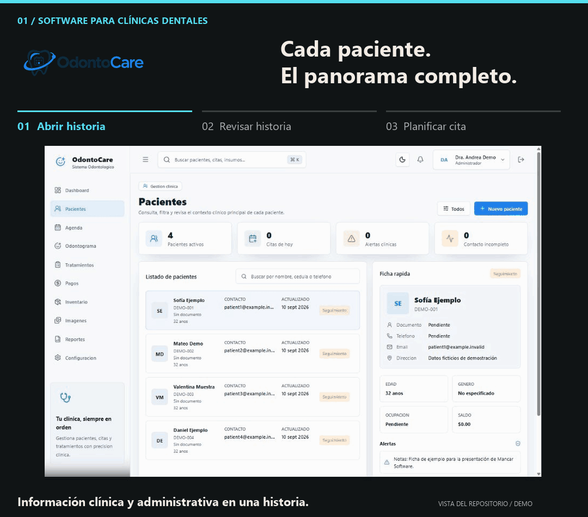
</picture>
</a>

Una aplicación para Windows que permite gestionar pacientes, citas, tratamientos y pagos sin depender de internet.

Interfaz capturada del repositorio · Datos clínicos ficticios · Interfaz original en español

<a href="https://github.com/MancarSoftware/odonto_care">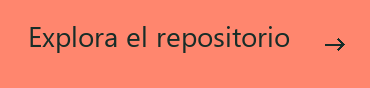</a>

**Diseñado para:** clínicas dentales que gestionan el trabajo clínico y administrativo en un solo lugar.

**Funciones principales:** historias clínicas, citas, odontogramas, tratamientos, pagos, inventario e informes. Los flujos documentados también incluyen roles de usuario, auditoría, copias de seguridad y restauración.

**Desarrollado con:** Electron, React, TypeScript, NestJS, PostgreSQL y Prisma.

Instalación y detalles técnicos

Diseñada como una aplicación instalable para Windows con almacenamiento local en PostgreSQL. El instalador administra los servicios necesarios para que la clínica trabaje sin conexión. El repositorio documenta la verificación de flujos críticos, empaquetado, restauración de copias de seguridad e instalación.

Función destacada: historia clínica

**Da seguimiento a cada visita.**

La vista de historia clínica reúne los registros anteriores del paciente para que el equipo revise la atención previa antes de documentar una nueva visita.

### 02 / VetCare Pro

<a href="https://github.com/MancarSoftware/vetCarePro">
<picture>
  <source media="(prefers-reduced-motion: reduce) and (max-width: 600px)" srcset="profile/assets/es/project-vetcare-mobile.png" />
  <source media="(prefers-reduced-motion: reduce)" srcset="profile/assets/es/project-vetcare.png" />
  <source media="(max-width: 600px)" srcset="profile/assets/es/project-vetcare-mobile.gif" />
  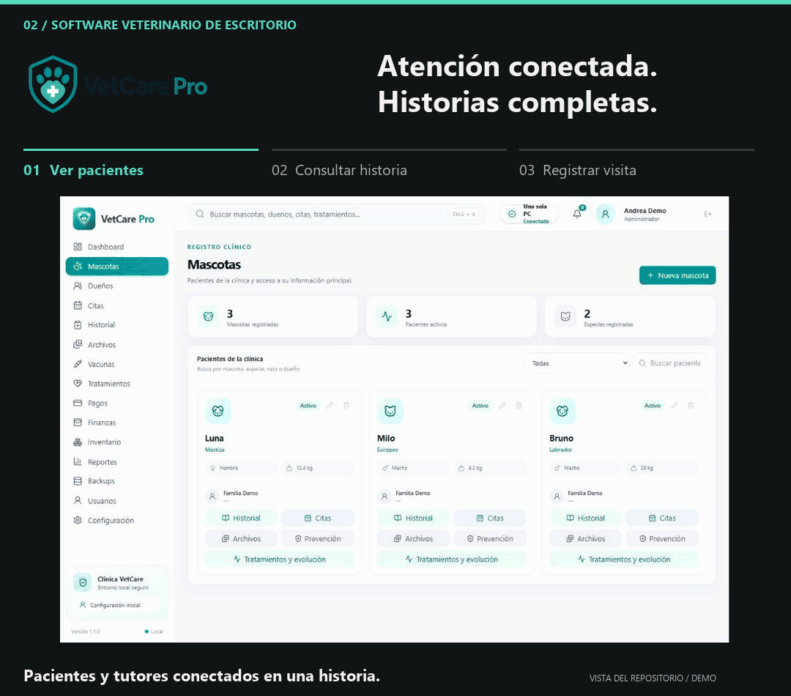
</picture>
</a>

Software veterinario para un equipo independiente o una red local, con historias clínicas, agenda y pagos accesibles en toda la clínica.

Interfaz capturada del repositorio · Datos clínicos ficticios · Interfaz original en español

**Diseñado para:** equipos veterinarios que trabajan desde una computadora o varias dentro de la misma clínica.

**Funciones principales:** pacientes, historias clínicas, citas, vacunas, tratamientos, imágenes y pagos. La red local permite que recepción, personal veterinario y caja accedan al mismo sistema.

**Desarrollado con:** Electron, Node.js y PostgreSQL.

Instalación y detalles técnicos

Admite los modos independiente, servidor LAN y cliente LAN en Windows. Una computadora aloja los servicios y datos locales; las demás se conectan por la red de la clínica. Este flujo local no requiere internet. El repositorio incluye guías de instalación, configuración de red y copias de seguridad.

Función destacada: contexto clínico compartido

**La historia clínica, en el centro de la atención.**

La historia clínica conserva el contexto entre visitas. En la configuración LAN documentada, las computadoras de la clínica acceden a los mismos servicios y datos locales.

### 03 / Alma Vet

<a href="https://github.com/MancarSoftware/veterinaria">
<picture>
  <source media="(prefers-reduced-motion: reduce) and (max-width: 600px)" srcset="profile/assets/es/project-almavet-mobile.png" />
  <source media="(prefers-reduced-motion: reduce)" srcset="profile/assets/es/project-almavet.png" />
  <source media="(max-width: 600px)" srcset="profile/assets/es/project-almavet-mobile.gif" />
  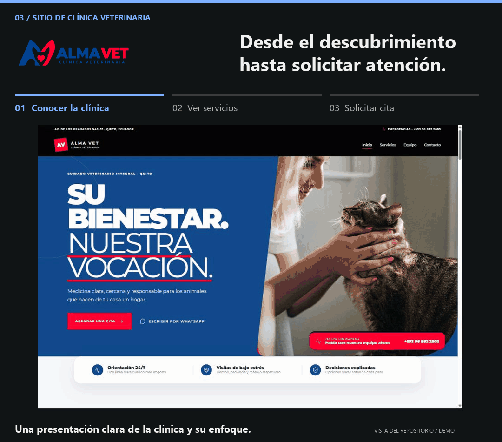
</picture>
</a>

Un sitio para una clínica veterinaria que guía a los tutores desde la consulta de servicios hasta una solicitud de cita estructurada.

Interfaz capturada del repositorio · Contenido de demostración · Interfaz original en español

**Diseñado para:** la clínica Alma Vet y los tutores que solicitan atención para sus mascotas.

**Funciones principales:** consulta de servicios y solicitudes de cita estructuradas, con validación en el servidor, protección contra bots, almacenamiento persistente y notificaciones por correo. Cada solicitud se envía para revisión y no confirma automáticamente una cita.

**Desarrollado con:** React, Supabase, PostgreSQL, Cloudflare Turnstile y Resend.

Función destacada: solicitudes de cita

**Información útil desde el primer contacto.**

El formulario recoge los datos necesarios para que la clínica revise la solicitud. Enviarlo solicita atención; no confirma una cita.

### 04 / Casa Nativa

<a href="https://github.com/MancarSoftware/muebleria">
<picture>
  <source media="(prefers-reduced-motion: reduce) and (max-width: 600px)" srcset="profile/assets/es/project-casanativa-mobile.png" />
  <source media="(prefers-reduced-motion: reduce)" srcset="profile/assets/es/project-casanativa.png" />
  <source media="(max-width: 600px)" srcset="profile/assets/es/project-casanativa-mobile.gif" />
  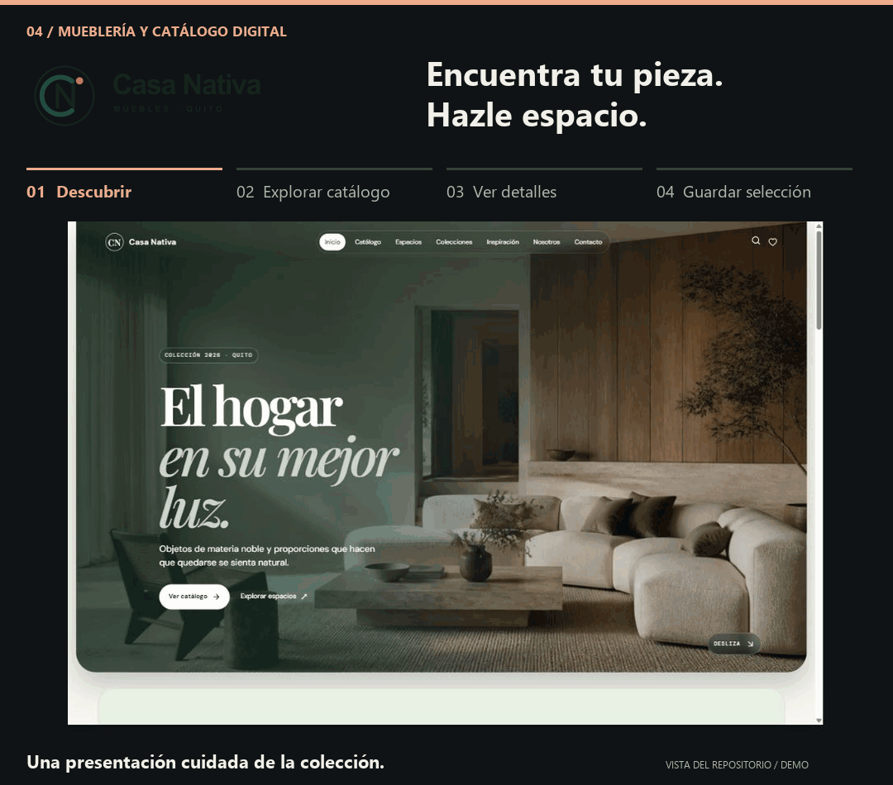
</picture>
</a>

Un sitio de muebles con catálogo editable, variantes de color y flujos estructurados para consultas de clientes.

Interfaz capturada del repositorio · Contenido de demostración · Interfaz original en español

**Diseñado para:** Casa Nativa y clientes que buscan muebles para su hogar.

**Funciones principales:** un catálogo con fotografías y variantes de color, un área de administración para publicar productos y herramientas para propuestas de espacios y consultas de clientes.

**Desarrollado con:** React, TypeScript, Vite y Supabase.

Función destacada: selección guardada

**Reúne tus opciones favoritas.**

«Mi espacio» reúne las piezas seleccionadas para que el cliente revise sus opciones antes de hacer una consulta.

## Cuándo contar con nosotros

<picture>
  <source media="(prefers-reduced-motion: reduce) and (max-width: 600px)" srcset="profile/assets/es/mancar-starting-points-mobile.png" />
  <source media="(prefers-reduced-motion: reduce)" srcset="profile/assets/es/mancar-starting-points.png" />
  <source media="(max-width: 600px)" srcset="profile/assets/es/mancar-starting-points-mobile.gif" />
  
</picture>

Quizá estés empezando algo nuevo, dedicando demasiado tiempo a tareas repetitivas, mejorando un producto existente o buscando soporte técnico continuo. Partimos de esa situación para definir juntos un próximo paso útil.

## Las personas detrás de Mancar

<picture>
  <source media="(prefers-reduced-motion: reduce) and (max-width: 600px)" srcset="profile/assets/es/mancar-team-mobile.png" />
  <source media="(prefers-reduced-motion: reduce)" srcset="profile/assets/es/mancar-team.png" />
  <source media="(max-width: 600px)" srcset="profile/assets/es/mancar-team-mobile.gif" />
  
</picture>

Mancar reúne desarrollo integral, especialización en interfaces e ingeniería de servidor. Alejandro Mantilla conecta la arquitectura técnica con la experiencia de uso. Jeremy Macias transforma los flujos del negocio en interfaces claras y accesibles. Nuestro equipo de servidor desarrolla los servicios y la automatización que sostienen el producto.

## Capacidades que conectamos

<picture>
  <source media="(prefers-reduced-motion: reduce) and (max-width: 600px)" srcset="profile/assets/es/mancar-disciplines-mobile.png" />
  <source media="(prefers-reduced-motion: reduce)" srcset="profile/assets/es/mancar-disciplines.png" />
  <source media="(max-width: 600px)" srcset="profile/assets/es/mancar-disciplines-mobile.gif" />
  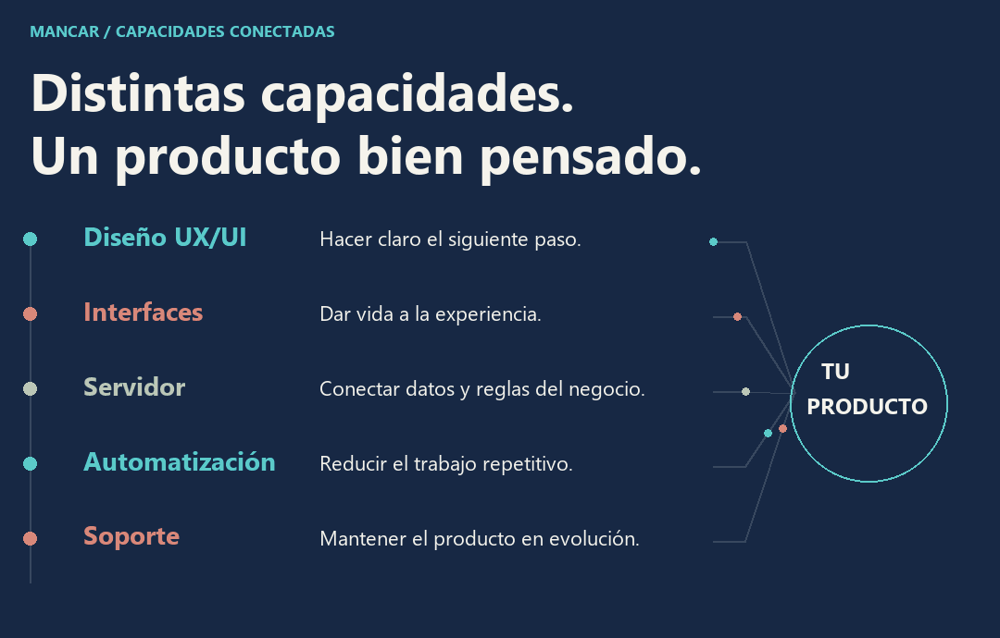
</picture>

Diseño de experiencia e interfaces, desarrollo visual, ingeniería de servidor, automatización y soporte comparten un objetivo: un producto adecuado para el negocio y claro para quienes lo usan. Integramos las capacidades necesarias en cada proyecto y conectamos las decisiones de experiencia y tecnología.

## Cómo trabajamos

<picture>
  <source media="(prefers-reduced-motion: reduce) and (max-width: 600px)" srcset="profile/assets/es/mancar-approach-mobile.png" />
  <source media="(prefers-reduced-motion: reduce)" srcset="profile/assets/es/mancar-approach.png" />
  <source media="(max-width: 600px)" srcset="profile/assets/es/mancar-approach-mobile.gif" />
  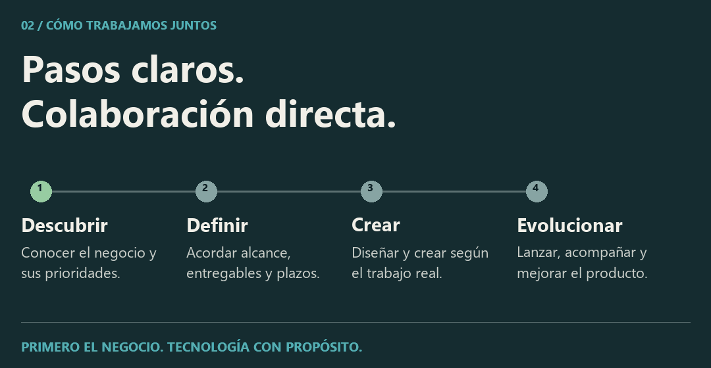
</picture>

Acordamos alcance, prioridades y plazos antes del desarrollo; luego avanzamos por etapas visibles y con decisiones claras. La calidad del diseño, el rendimiento, la seguridad y la facilidad de mantenimiento guían el trabajo hasta el lanzamiento y durante su evolución.

Elegimos la tecnología según el flujo de trabajo, con operación local o en red LAN cuando la continuidad lo requiere.

## En detalle: Casa Nativa

<picture>
  <source media="(prefers-reduced-motion: reduce) and (max-width: 600px)" srcset="profile/assets/es/mancar-casa-story-mobile.png" />
  <source media="(prefers-reduced-motion: reduce)" srcset="profile/assets/es/mancar-casa-story.png" />
  <source media="(max-width: 600px)" srcset="profile/assets/es/mancar-casa-story-mobile.gif" />
  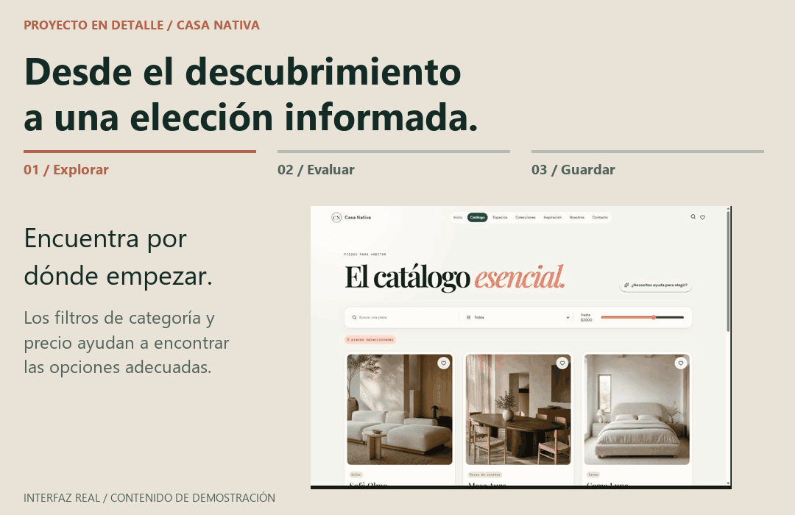
</picture>

Quien busca muebles necesita más que un nombre: requiere detalles para decidir si una pieza encaja en su hogar. Casa Nativa conecta la exploración, la información del producto y la selección guardada en una misma experiencia.

**La necesidad del cliente:** reducir las opciones y entender cómo encaja una pieza en el espacio.

**La decisión de diseño:** mostrar fotografías junto a medidas, materiales y colores, con filtros de catálogo que facilitan la búsqueda.

**La funcionalidad resultante:** el cliente puede explorar el catálogo, revisar un producto y guardar piezas en «Mi espacio» antes de consultar.

Interfaz capturada del repositorio · Contenido de demostración · Interfaz original en español

<a href="https://github.com/MancarSoftware/muebleria">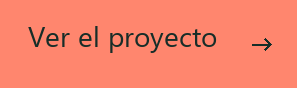</a>

## Después del lanzamiento

<picture>
  <source media="(prefers-reduced-motion: reduce) and (max-width: 600px)" srcset="profile/assets/es/mancar-support-mobile.png" />
  <source media="(prefers-reduced-motion: reduce)" srcset="profile/assets/es/mancar-support.png" />
  <source media="(max-width: 600px)" srcset="profile/assets/es/mancar-support-mobile.gif" />
  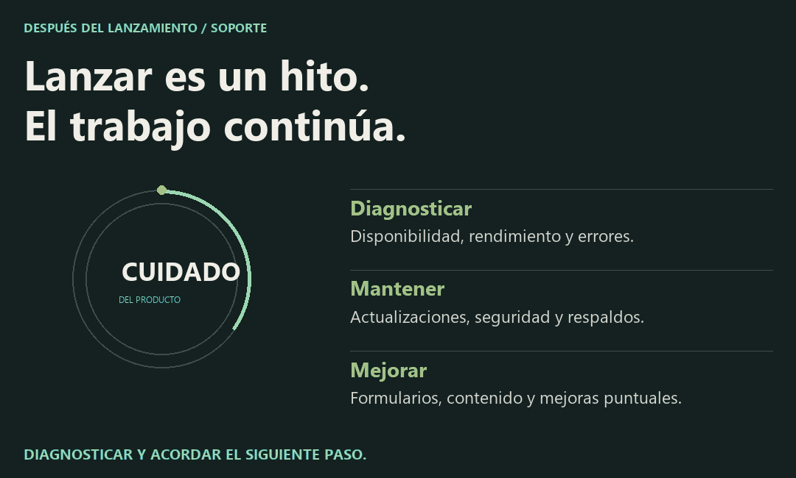
</picture>

El producto necesita atención a medida que cambia el negocio. Nuestro soporte cubre disponibilidad y rendimiento, formularios y envío de correos, actualizaciones, copias de seguridad y mejoras puntuales de contenido o funcionalidad.

Revisamos el contexto antes de intervenir y priorizamos los incidentes que afectan ventas, formularios o disponibilidad. Después del diagnóstico acordamos la intervención y los siguientes pasos.

**Horario de soporte:** Lunes a viernes, de 9:00 a 18:00, hora de Ecuador (UTC−5).

<a href="https://ale-mancar.github.io/mancar_software/soporte/">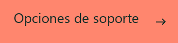</a>

## ¿Qué pasa cuando nos contactas?

<picture>
  <source media="(prefers-reduced-motion: reduce) and (max-width: 600px)" srcset="profile/assets/es/mancar-first-conversation-mobile.png" />
  <source media="(prefers-reduced-motion: reduce)" srcset="profile/assets/es/mancar-first-conversation.png" />
  <source media="(max-width: 600px)" srcset="profile/assets/es/mancar-first-conversation-mobile.gif" />
  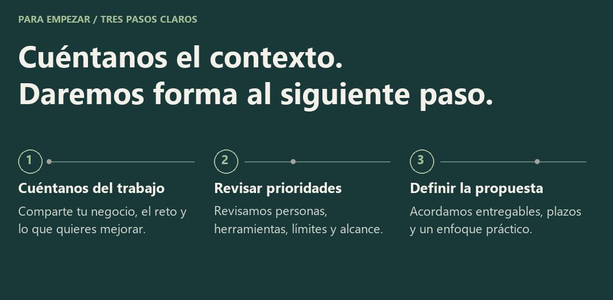
</picture>

Cuéntanos un reto del negocio, muéstranos un producto existente o comparte un ejemplo de lo que quieres mejorar. Con ese contexto evaluaremos el trabajo y definiremos una propuesta práctica.

## Trabajar con nosotros

¿Pueden mejorar un producto existente?

Sí. Revisamos la experiencia actual, el flujo de trabajo y el contexto técnico antes de recomendar mejoras concretas.

¿Qué debo preparar antes de contactarles?

Para empezar basta una breve descripción de tu negocio, el problema que quieres resolver y tus prioridades. Si tienes un producto o ejemplo, compártelo; no necesitas una especificación técnica.

¿Cómo se organiza el soporte continuo?

Primero revisamos el problema y su impacto; luego acordamos la intervención y los siguientes pasos. El soporte puede incluir disponibilidad, rendimiento, formularios, actualizaciones, copias de seguridad o mejoras puntuales. Contáctanos para definir el alcance que necesita tu producto.

## Conversemos

<picture>
  <source media="(prefers-reduced-motion: reduce) and (max-width: 600px)" srcset="profile/assets/es/mancar-contact-mobile.png" />
  <source media="(prefers-reduced-motion: reduce)" srcset="profile/assets/es/mancar-contact.png" />
  <source media="(max-width: 600px)" srcset="profile/assets/es/mancar-contact-mobile.gif" />
  
</picture>

<a href="tel:+593986951419">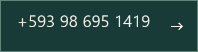</a>
<a href="https://ale-mancar.github.io/mancar_software/">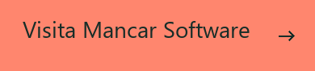</a>

MANCAR SOFTWARE · GUAYAQUIL, ECUADOR
