# A closer look at the work

Still frames from the project interface tours. All clinical names and records are fictional demonstration data; website content comes from the repositories. These previews document interface design and do not constitute evidence of a production deployment or end-to-end backend testing.

## OdontoCare

### 01 / Open record

Clinical and administrative context in one record.

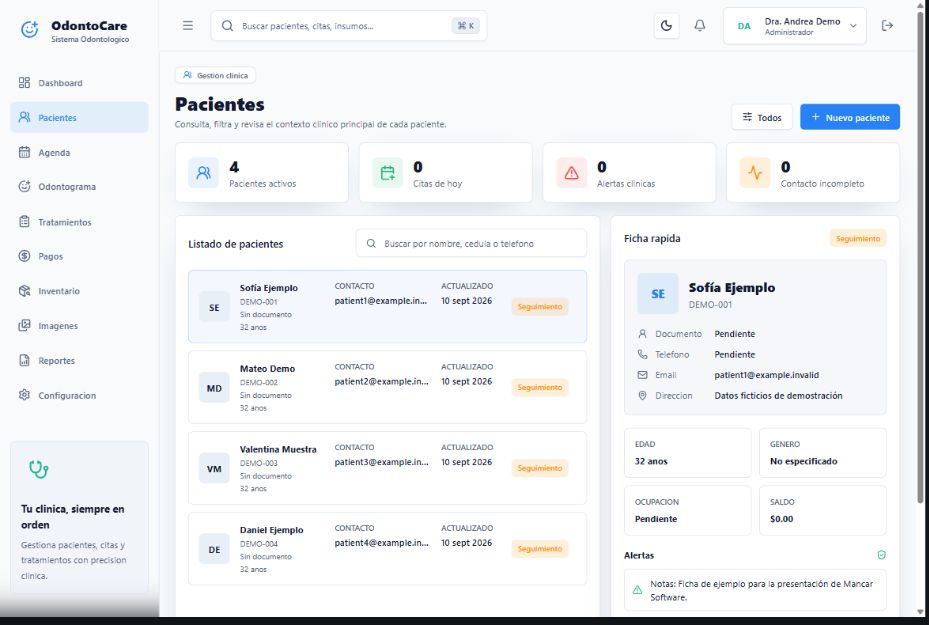

### 02 / Review history

A complete history across visits.

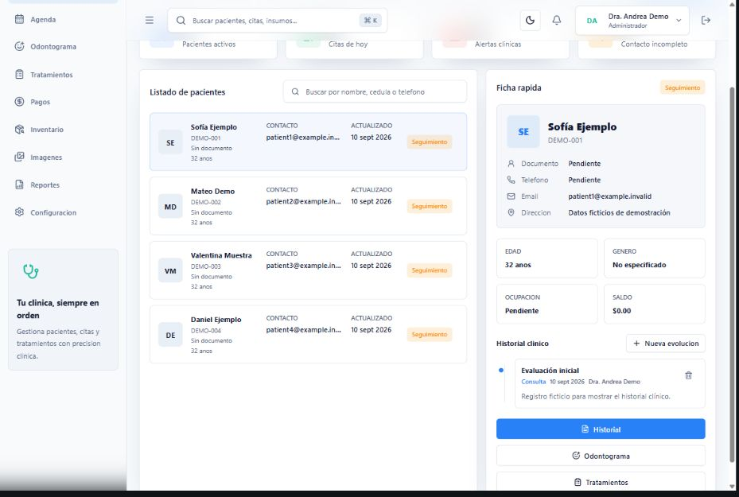

### 03 / Plan next visit

Appointments organized in a clear daily view.

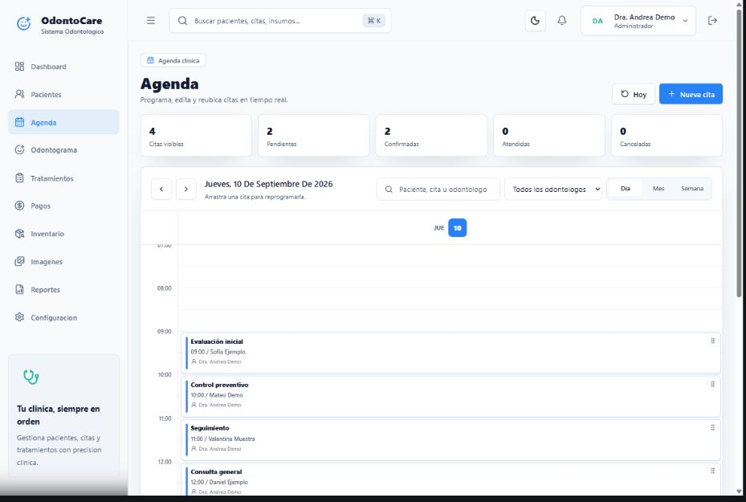

## VetCare Pro

### 01 / View records

Patients and their owners connected in one record.

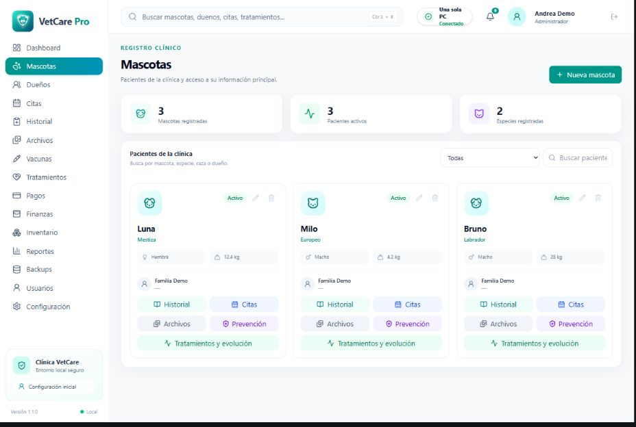

### 02 / Follow history

Clinical context preserved across visits.

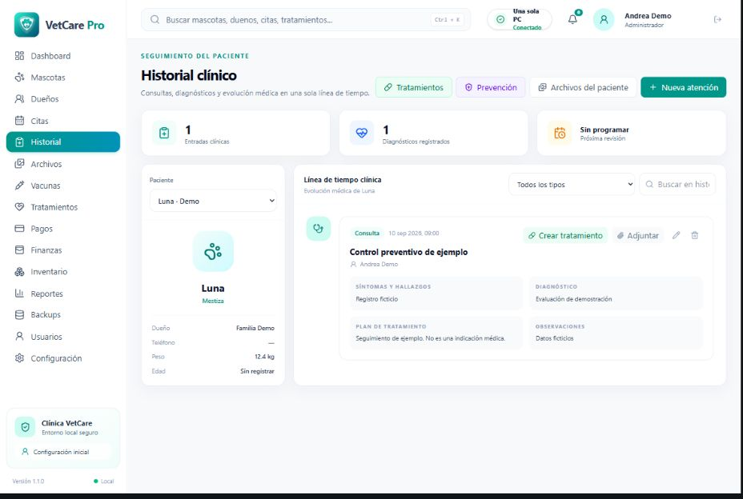

### 03 / Document visit

A structured workflow for documenting care.

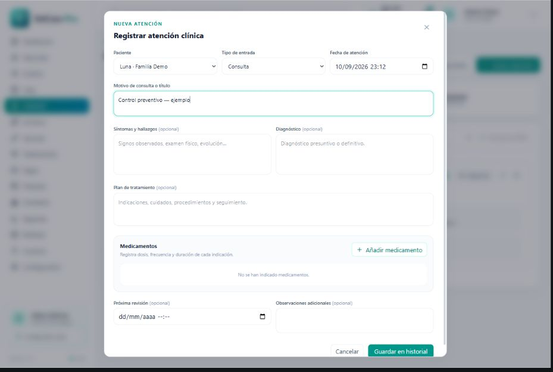

## Alma Vet

### 01 / Meet the clinic

A clear introduction to the clinic and its approach.

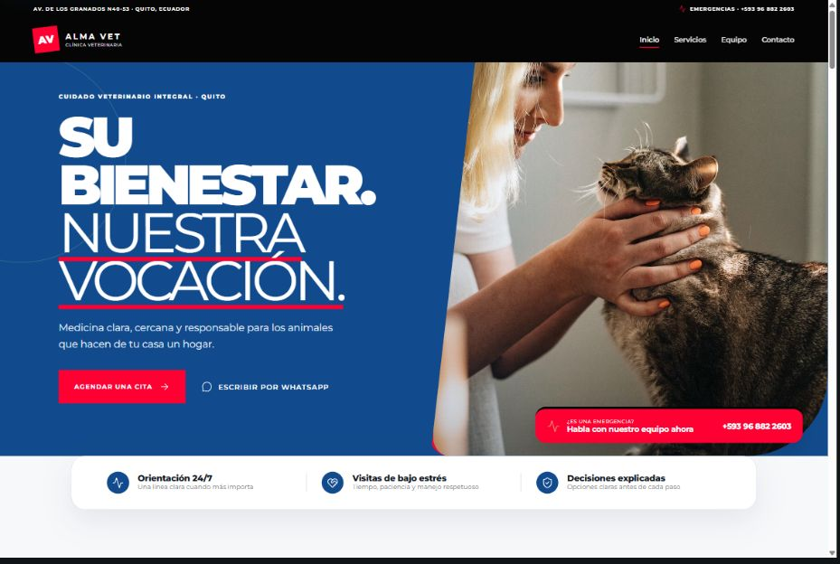

### 02 / Review services

Services organized around common care needs.

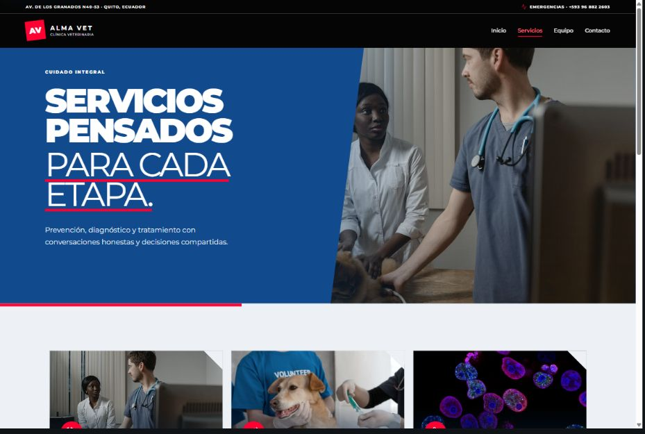

### 03 / Request a visit

A structured request for the clinic to review.

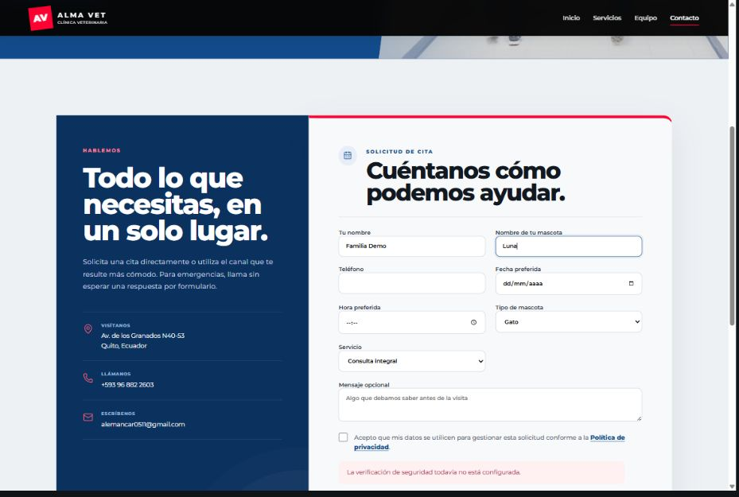

## Casa Nativa

### 01 / Discover

An editorial introduction to the collection.

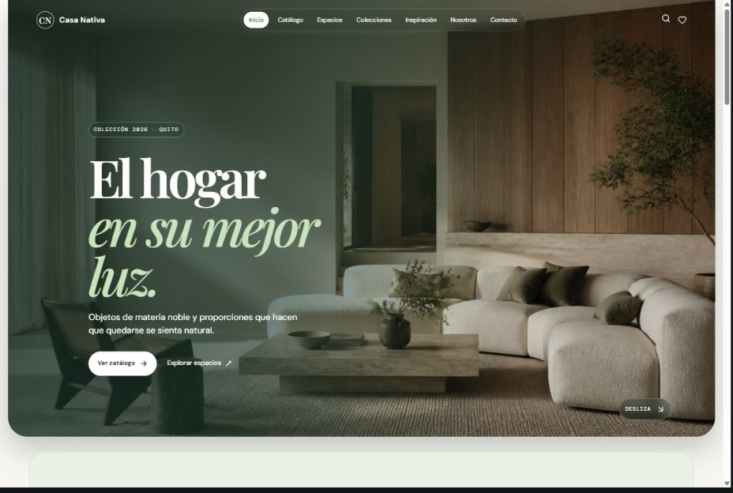

### 02 / Browse catalog

Furniture organized by category and price.

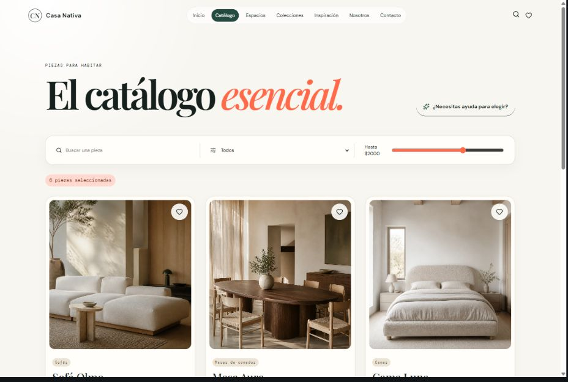

### 03 / Review details

Materials, dimensions, and color options in context.

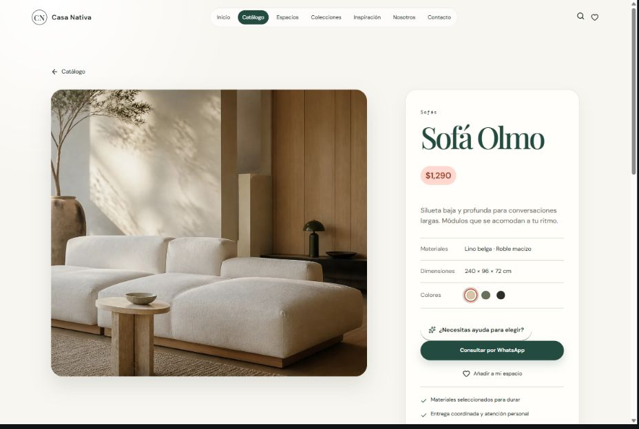

### 04 / Save selection

A saved selection ready for an inquiry.

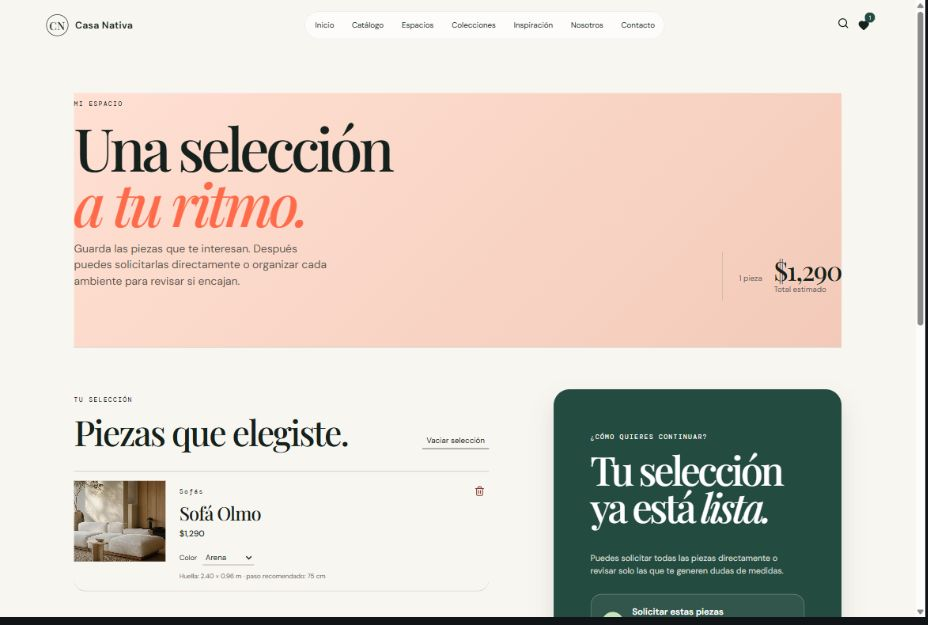

[Capture sources and reproduction notes](PROJECT-EVIDENCE.md)
