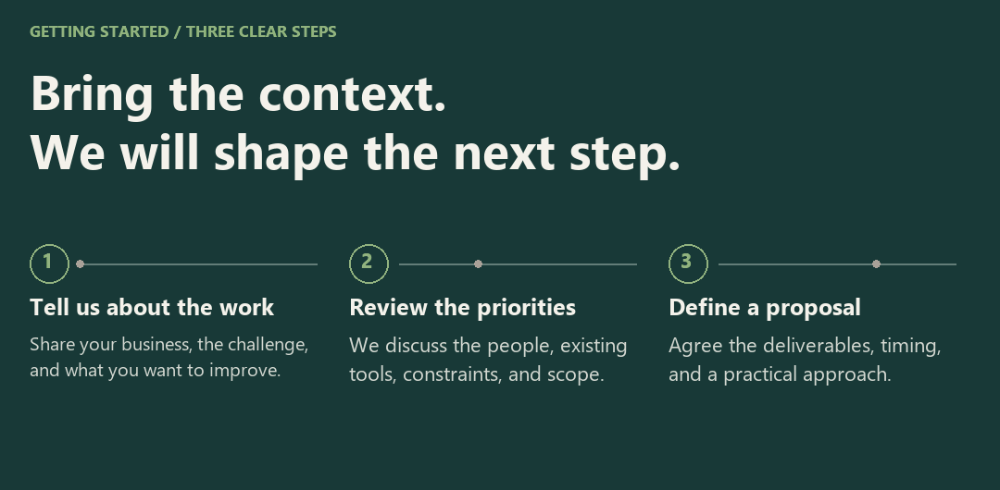

<picture>
  <source media="(prefers-reduced-motion: reduce) and (max-width: 600px)" srcset="assets/mancar-studio-cover-mobile.png" />
  <source media="(prefers-reduced-motion: reduce)" srcset="assets/mancar-studio-cover.png" />
  <source media="(max-width: 600px)" srcset="assets/mancar-studio-cover-mobile.gif" />
  
</picture>

# Mancar Software

We bring strategy, design, and development together to help businesses earn trust, simplify daily work, and build for what comes next. Based in Guayaquil, Ecuador, we work directly with the people behind each business, from the first conversation through launch and ongoing support.

## Selected Projects

### 01 / OdontoCare

<a href="https://github.com/MancarSoftware/odonto_care">
<picture>
  <source media="(prefers-reduced-motion: reduce) and (max-width: 600px)" srcset="assets/project-odontocare-mobile.png" />
  <source media="(prefers-reduced-motion: reduce)" srcset="assets/project-odontocare.png" />
  <source media="(max-width: 600px)" srcset="assets/project-odontocare-mobile.gif" />
  
</picture>
</a>

An offline-ready Windows application for managing patient records, appointments, treatments, and payments.

Interface captured from the repository · Fictional clinical data · Original interface in Spanish

**Designed For:** dental clinics managing clinical and administrative work in one place.

**Core Functionality:** patient histories, appointments, odontograms, treatments, payments, inventory, and reporting. The documented workflows also cover user roles, audit records, backups, and restoration.

**Built With:** Electron, React, TypeScript, NestJS, PostgreSQL, and Prisma.

Deployment and Engineering Details

Designed as an installable Windows application with local PostgreSQL storage. The production installer manages the required application services, allowing the clinic to work offline. The repository documents verification procedures for critical workflows, packaging, backup restoration, and installation.

Feature in Focus: Clinical History

**Follow care across visits.**

The history view brings previous clinical entries into the patient context, helping the team review earlier care before documenting the next visit.

### 02 / VetCare Pro

<a href="https://github.com/MancarSoftware/vetCarePro">
<picture>
  <source media="(prefers-reduced-motion: reduce) and (max-width: 600px)" srcset="assets/project-vetcare-mobile.png" />
  <source media="(prefers-reduced-motion: reduce)" srcset="assets/project-vetcare.png" />
  <source media="(max-width: 600px)" srcset="assets/project-vetcare-mobile.gif" />
  
</picture>
</a>

Veterinary practice software for standalone and local network environments, with clinical records, scheduling, and payments accessible across the clinic.

Interface captured from the repository · Fictional clinical data · Original interface in Spanish

**Designed For:** veterinary teams working from a single computer or across several computers in the same clinic.

**Core Functionality:** patient records, clinical histories, appointments, vaccinations, treatments, images, and payments. Local network support allows reception, veterinary staff, and the payment desk to access the same system.

**Built With:** Electron, Node.js, and PostgreSQL.

Deployment and Engineering Details

Supports standalone, LAN server, and LAN client modes on Windows. One computer hosts the local services and data, while the others connect through the clinic's network. This local workflow does not require internet access. The repository includes guidance for installation, network configuration, and backups.

Feature in Focus: Shared Clinical Context

**Keep the record at the center of care.**

The clinical history view preserves context across visits. In the documented LAN configuration, clinic computers access the same local services and data.

### 03 / Alma Vet

<a href="https://github.com/MancarSoftware/veterinaria">
<picture>
  <source media="(prefers-reduced-motion: reduce) and (max-width: 600px)" srcset="assets/project-almavet-mobile.png" />
  <source media="(prefers-reduced-motion: reduce)" srcset="assets/project-almavet.png" />
  <source media="(max-width: 600px)" srcset="assets/project-almavet-mobile.gif" />
  
</picture>
</a>

A veterinary clinic website that guides pet owners from service discovery to a structured appointment request.

Interface captured from the repository · Repository demo content · Original interface in Spanish

**Designed For:** the Alma Vet clinic and pet owners requesting care.

**Core Functionality:** service discovery and structured appointment requests, supported by server-side validation, bot protection, persistent request storage, and email notifications. Each request is submitted for review and does not automatically confirm an appointment.

**Built With:** React, Supabase, PostgreSQL, Cloudflare Turnstile, and Resend.

Feature in Focus: Appointment Requests

**Give the clinic useful information upfront.**

The request form collects the details needed for the clinic to review a visit request. Submitting it requests care; it does not confirm an appointment.

### 04 / Casa Nativa

<a href="https://github.com/MancarSoftware/muebleria">
<picture>
  <source media="(prefers-reduced-motion: reduce) and (max-width: 600px)" srcset="assets/project-casanativa-mobile.png" />
  <source media="(prefers-reduced-motion: reduce)" srcset="assets/project-casanativa.png" />
  <source media="(max-width: 600px)" srcset="assets/project-casanativa-mobile.gif" />
  
</picture>
</a>

A furniture retail website with an editable catalog, color variants, and structured customer inquiry workflows.

Interface captured from the repository · Repository demo content · Original interface in Spanish

**Designed For:** Casa Nativa and customers exploring furniture for their homes.

**Core Functionality:** a furniture catalog with product photography and color variants, an administration area for publishing products, and tools for space proposals and customer inquiries.

**Built With:** React, TypeScript, Vite, and Supabase.

Feature in Focus: Saved Selections

**Bring the shortlist together.**

“Mi espacio” groups selected pieces so customers can review their choices before making an inquiry.

## When to Bring Us In

<picture>
  <source media="(prefers-reduced-motion: reduce) and (max-width: 600px)" srcset="assets/mancar-starting-points-mobile.png" />
  <source media="(prefers-reduced-motion: reduce)" srcset="assets/mancar-starting-points.png" />
  <source media="(max-width: 600px)" srcset="assets/mancar-starting-points-mobile.gif" />
  
</picture>

You may be starting something new, spending too much time on repetitive tasks, improving a product you already have, or looking for ongoing technical support. We begin with that situation and identify a useful next step together.

## The People Behind Mancar

<picture>
  <source media="(prefers-reduced-motion: reduce) and (max-width: 600px)" srcset="assets/mancar-team-mobile.png" />
  <source media="(prefers-reduced-motion: reduce)" srcset="assets/mancar-team.png" />
  <source media="(max-width: 600px)" srcset="assets/mancar-team-mobile.gif" />
  
</picture>

Mancar brings together full stack development, frontend craft, and backend engineering. Alejandro Mantilla connects technical architecture with the user experience. Jeremy Macias turns business workflows into clear, accessible interfaces. Our backend team develops the services and automation that support the product.

## What We Bring Together

<picture>
  <source media="(prefers-reduced-motion: reduce) and (max-width: 600px)" srcset="assets/mancar-disciplines-mobile.png" />
  <source media="(prefers-reduced-motion: reduce)" srcset="assets/mancar-disciplines.png" />
  <source media="(max-width: 600px)" srcset="assets/mancar-disciplines-mobile.gif" />
  
</picture>

UX/UI design, frontend development, backend engineering, automation, and support contribute to the same goal: a product that fits the business and is clear for the people using it. We bring in the disciplines each project needs, with decisions connected across the experience and the technology behind it.

## How We Work

<picture>
  <source media="(prefers-reduced-motion: reduce) and (max-width: 600px)" srcset="assets/mancar-approach-mobile.png" />
  <source media="(prefers-reduced-motion: reduce)" srcset="assets/mancar-approach.png" />
  <source media="(max-width: 600px)" srcset="assets/mancar-approach-mobile.gif" />
  
</picture>

We agree the scope, priorities, and timing before development, then work in visible stages with clear decisions. Design quality, performance, security, and maintainability guide the work through launch and ongoing care.

We choose technology to fit the workflow, including local and LAN operation where continuity matters.

## In Focus: Casa Nativa

<picture>
  <source media="(prefers-reduced-motion: reduce) and (max-width: 600px)" srcset="assets/mancar-casa-story-mobile.png" />
  <source media="(prefers-reduced-motion: reduce)" srcset="assets/mancar-casa-story.png" />
  <source media="(max-width: 600px)" srcset="assets/mancar-casa-story-mobile.gif" />
  
</picture>

Furniture customers need more than a product name: they need enough detail to judge whether a piece belongs in their home. Casa Nativa brings browsing, product information, and a saved selection into one connected experience.

**The Customer Task:** narrow the options and understand how a piece fits the space.

**The Interface Decision:** place photography alongside dimensions, materials, and color options, with catalog filters to support discovery.

**The Resulting Functionality:** customers can explore the catalog, inspect a product, and save pieces to “Mi espacio” before making an inquiry.

Interface captured from the repository · Repository demo content · Original interface in Spanish

## Beyond Launch

<picture>
  <source media="(prefers-reduced-motion: reduce) and (max-width: 600px)" srcset="assets/mancar-support-mobile.png" />
  <source media="(prefers-reduced-motion: reduce)" srcset="assets/mancar-support.png" />
  <source media="(max-width: 600px)" srcset="assets/mancar-support-mobile.gif" />
  
</picture>

A product needs attention as the business changes. Our support work covers availability and performance issues, form submissions and email delivery, updates, backups, and focused improvements to content or functionality.

We review the context before making changes and prioritize incidents that affect sales, forms, or availability. The intervention and next steps are agreed after diagnosis.

**Support Hours:** Monday–Friday, 9:00 a.m.–6:00 p.m., Ecuador time (UTC−5).

## What Happens After You Contact Us?

<picture>
  <source media="(prefers-reduced-motion: reduce) and (max-width: 600px)" srcset="assets/mancar-first-conversation-mobile.png" />
  <source media="(prefers-reduced-motion: reduce)" srcset="assets/mancar-first-conversation.png" />
  <source media="(max-width: 600px)" srcset="assets/mancar-first-conversation-mobile.gif" />
  
</picture>

Bring a business challenge, an existing product, or a simple example of what you want to improve. We will use that context to assess the work and define a practical proposal.

## Working With Us

Can You Improve an Existing Product?

Yes. We review the current experience, workflow, and technical context before recommending focused improvements.

What Should I Prepare Before Contacting You?

A brief description of your business, the problem you want to solve, and your priorities is enough to begin. Include an existing product or an example if available; a technical specification is not required.

How Is Ongoing Support Arranged?

We first review the issue and its impact, then agree the intervention and next steps. Support may include availability, performance, forms, updates, backups, or focused improvements. Contact us to discuss the scope your product needs.

## Start a Conversation

<picture>
  <source media="(prefers-reduced-motion: reduce) and (max-width: 600px)" srcset="assets/mancar-contact-mobile.png" />
  <source media="(prefers-reduced-motion: reduce)" srcset="assets/mancar-contact.png" />
  <source media="(max-width: 600px)" srcset="assets/mancar-contact-mobile.gif" />
  
</picture>

MANCAR SOFTWARE · GUAYAQUIL, ECUADOR
