

<picture>
  <source media="(prefers-reduced-motion: reduce) and (max-width: 600px)" srcset="assets/hi/mancar-studio-cover-mobile.png" />
  <source media="(prefers-reduced-motion: reduce)" srcset="assets/hi/mancar-studio-cover.png" />
  <source media="(max-width: 600px)" srcset="assets/hi/mancar-studio-cover-mobile.gif" />
  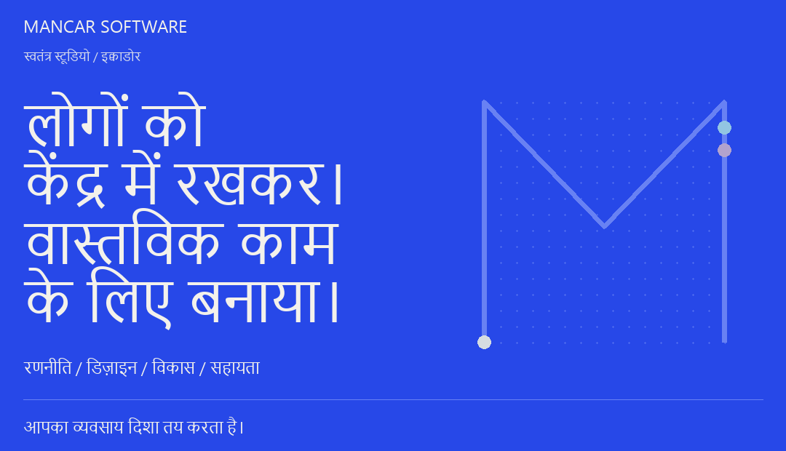
</picture>

# Mancar Software

हम रणनीति, डिज़ाइन और विकास को साथ लाकर व्यवसायों को विश्वास बनाने, रोज़मर्रा का काम सरल करने और भविष्य के लिए तैयार होने में मदद करते हैं। ग्वायाकिल, इक्वाडोर से हम हर व्यवसाय के लोगों के साथ सीधे काम करते हैं—पहली बातचीत से लॉन्च और निरंतर सहायता तक।

## चुनिंदा परियोजनाएँ

### 01 / OdontoCare

<a href="https://github.com/MancarSoftware/odonto_care">
<picture>
  <source media="(prefers-reduced-motion: reduce) and (max-width: 600px)" srcset="assets/hi/project-odontocare-mobile.png" />
  <source media="(prefers-reduced-motion: reduce)" srcset="assets/hi/project-odontocare.png" />
  <source media="(max-width: 600px)" srcset="assets/hi/project-odontocare-mobile.gif" />
  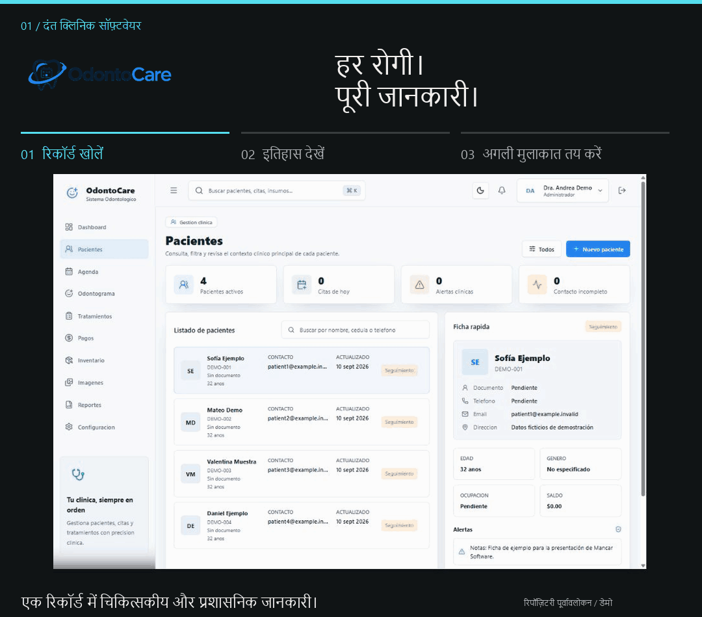
</picture>
</a>

रोगी रिकॉर्ड, अपॉइंटमेंट, उपचार और भुगतान के प्रबंधन के लिए ऑफ़लाइन चलने वाला Windows अनुप्रयोग।

रिपॉज़िटरी से लिया गया इंटरफ़ेस · काल्पनिक चिकित्सा डेटा · मूल इंटरफ़ेस स्पैनिश में

<a href="https://github.com/MancarSoftware/odonto_care">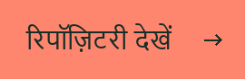</a>

**इनके लिए:** एक ही स्थान पर चिकित्सकीय और प्रशासनिक काम संभालने वाले दंत क्लिनिक।

**मुख्य सुविधाएँ:** चिकित्सा इतिहास, अपॉइंटमेंट, दंत चार्ट, उपचार, भुगतान, इन्वेंटरी और रिपोर्ट। दस्तावेज़ित प्रक्रियाओं में उपयोगकर्ता भूमिकाएँ, ऑडिट रिकॉर्ड, बैकअप और पुनर्स्थापन भी शामिल हैं।

**प्रयुक्त तकनीक:** Electron, React, TypeScript, NestJS, PostgreSQL और Prisma।

परिनियोजन और तकनीकी विवरण

यह Windows पर इंस्टॉल होने वाला अनुप्रयोग है, जिसमें स्थानीय PostgreSQL भंडारण है। प्रोडक्शन इंस्टॉलर आवश्यक सेवाओं का प्रबंधन करता है, जिससे क्लिनिक ऑफ़लाइन काम कर सकता है। रिपॉज़िटरी में मुख्य कार्यप्रवाहों, पैकेजिंग, बैकअप बहाली और इंस्टॉलेशन की जाँच के निर्देश हैं।

विशेष सुविधा: चिकित्सा इतिहास

**हर मुलाकात की देखभाल का क्रम देखें।**

इतिहास दृश्य रोगी की पिछली चिकित्सकीय प्रविष्टियाँ साथ दिखाता है, ताकि टीम अगली मुलाकात दर्ज करने से पहले पिछली देखभाल की समीक्षा कर सके।

### 02 / VetCare Pro

<a href="https://github.com/MancarSoftware/vetCarePro">
<picture>
  <source media="(prefers-reduced-motion: reduce) and (max-width: 600px)" srcset="assets/hi/project-vetcare-mobile.png" />
  <source media="(prefers-reduced-motion: reduce)" srcset="assets/hi/project-vetcare.png" />
  <source media="(max-width: 600px)" srcset="assets/hi/project-vetcare-mobile.gif" />
  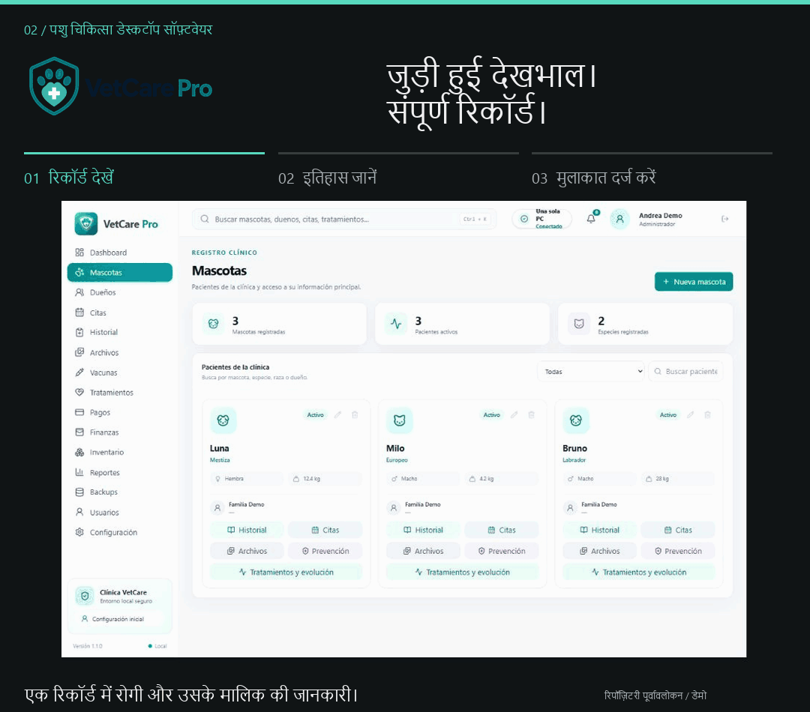
</picture>
</a>

एकल कंप्यूटर और स्थानीय नेटवर्क के लिए पशु चिकित्सा सॉफ़्टवेयर, जिसमें पूरे क्लिनिक में चिकित्सा रिकॉर्ड, समय-सारणी और भुगतान की जानकारी उपलब्ध रहती है।

रिपॉज़िटरी से लिया गया इंटरफ़ेस · काल्पनिक चिकित्सा डेटा · मूल इंटरफ़ेस स्पैनिश में

**इनके लिए:** एक क्लिनिक में एक या कई कंप्यूटरों पर काम करने वाली पशु चिकित्सा टीमें।

**मुख्य सुविधाएँ:** रोगी रिकॉर्ड, चिकित्सा इतिहास, अपॉइंटमेंट, टीकाकरण, उपचार, चित्र और भुगतान। स्थानीय नेटवर्क से रिसेप्शन, पशु चिकित्सक और भुगतान डेस्क एक ही प्रणाली का उपयोग कर सकते हैं।

**प्रयुक्त तकनीक:** Electron, Node.js और PostgreSQL।

परिनियोजन और तकनीकी विवरण

Windows पर एकल कंप्यूटर, LAN सर्वर और LAN क्लाइंट मोड उपलब्ध हैं। एक कंप्यूटर स्थानीय सेवाएँ और डेटा रखता है; दूसरे क्लिनिक के नेटवर्क से जुड़ते हैं। इस स्थानीय कार्यप्रवाह को इंटरनेट की ज़रूरत नहीं है। रिपॉज़िटरी में इंस्टॉलेशन, नेटवर्क सेटअप और बैकअप के निर्देश हैं।

विशेष सुविधा: साझा चिकित्सकीय जानकारी

**देखभाल के केंद्र में रिकॉर्ड रखें।**

चिकित्सा इतिहास दृश्य अलग-अलग मुलाकातों की जानकारी सुरक्षित रखता है। दस्तावेज़ित LAN व्यवस्था में क्लिनिक के कंप्यूटर एक ही स्थानीय सेवाओं और डेटा तक पहुँचते हैं।

### 03 / Alma Vet

<a href="https://github.com/MancarSoftware/veterinaria">
<picture>
  <source media="(prefers-reduced-motion: reduce) and (max-width: 600px)" srcset="assets/hi/project-almavet-mobile.png" />
  <source media="(prefers-reduced-motion: reduce)" srcset="assets/hi/project-almavet.png" />
  <source media="(max-width: 600px)" srcset="assets/hi/project-almavet-mobile.gif" />
  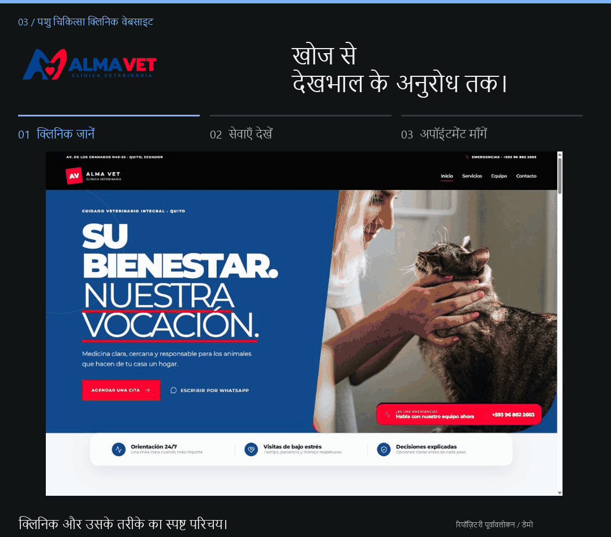
</picture>
</a>

पशु चिकित्सा क्लिनिक की वेबसाइट, जो पालतू पशुओं के मालिकों को सेवाएँ जानने से लेकर व्यवस्थित अपॉइंटमेंट अनुरोध तक पहुँचाती है।

रिपॉज़िटरी से लिया गया इंटरफ़ेस · डेमो सामग्री · मूल इंटरफ़ेस स्पैनिश में

**इनके लिए:** Alma Vet क्लिनिक और देखभाल का अनुरोध करने वाले पालतू पशुओं के मालिक।

**मुख्य सुविधाएँ:** सेवाओं की जानकारी और व्यवस्थित अपॉइंटमेंट अनुरोध, सर्वर पर सत्यापन, बॉट सुरक्षा, स्थायी अनुरोध भंडारण और ईमेल सूचनाओं के साथ। हर अनुरोध समीक्षा के लिए भेजा जाता है; अपॉइंटमेंट अपने-आप पक्का नहीं होता।

**प्रयुक्त तकनीक:** React, Supabase, PostgreSQL, Cloudflare Turnstile और Resend।

विशेष सुविधा: अपॉइंटमेंट अनुरोध

**क्लिनिक को पहले से उपयोगी जानकारी दें।**

फ़ॉर्म क्लिनिक को अनुरोध की समीक्षा के लिए आवश्यक जानकारी देता है। इसे भेजने से देखभाल का अनुरोध होता है, अपॉइंटमेंट की पुष्टि नहीं।

### 04 / Casa Nativa

<a href="https://github.com/MancarSoftware/muebleria">
<picture>
  <source media="(prefers-reduced-motion: reduce) and (max-width: 600px)" srcset="assets/hi/project-casanativa-mobile.png" />
  <source media="(prefers-reduced-motion: reduce)" srcset="assets/hi/project-casanativa.png" />
  <source media="(max-width: 600px)" srcset="assets/hi/project-casanativa-mobile.gif" />
  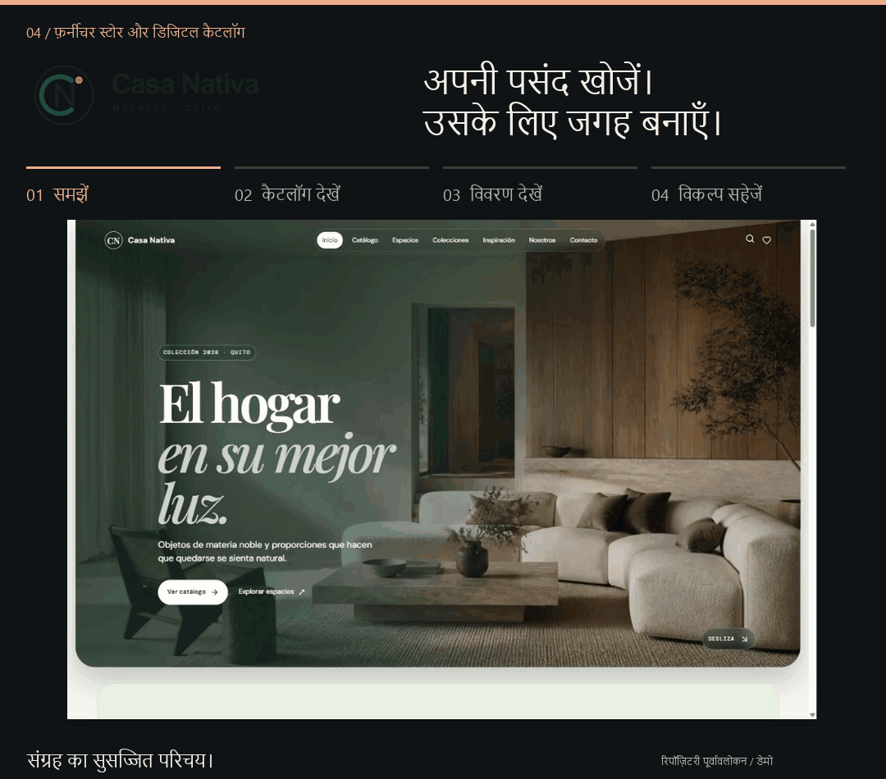
</picture>
</a>

संपादन योग्य कैटलॉग, रंग विकल्पों और व्यवस्थित ग्राहक पूछताछ प्रक्रियाओं वाली फ़र्नीचर वेबसाइट।

रिपॉज़िटरी से लिया गया इंटरफ़ेस · डेमो सामग्री · मूल इंटरफ़ेस स्पैनिश में

**इनके लिए:** Casa Nativa और अपने घर के लिए फ़र्नीचर तलाश रहे ग्राहक।

**मुख्य सुविधाएँ:** उत्पाद तस्वीरों और रंग विकल्पों वाला फ़र्नीचर कैटलॉग, उत्पाद प्रकाशित करने का प्रशासन क्षेत्र, तथा स्थान संबंधी प्रस्तावों और ग्राहक पूछताछ के उपकरण।

**प्रयुक्त तकनीक:** React, TypeScript, Vite और Supabase।

विशेष सुविधा: सहेजे गए विकल्प

**पसंदीदा विकल्प एक साथ रखें।**

“Mi espacio” (मेरा स्थान) चुनी गई वस्तुओं को एक साथ रखता है, ताकि ग्राहक पूछताछ से पहले अपने विकल्पों की समीक्षा कर सकें।

## कब हमसे जुड़ें

<picture>
  <source media="(prefers-reduced-motion: reduce) and (max-width: 600px)" srcset="assets/hi/mancar-starting-points-mobile.png" />
  <source media="(prefers-reduced-motion: reduce)" srcset="assets/hi/mancar-starting-points.png" />
  <source media="(max-width: 600px)" srcset="assets/hi/mancar-starting-points-mobile.gif" />
  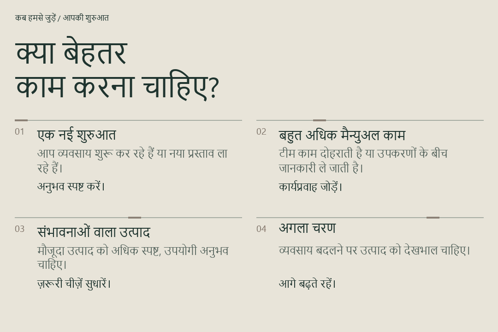
</picture>

आप कुछ नया शुरू कर रहे हों, दोहराए जाने वाले कामों में अधिक समय लगा रहे हों, किसी मौजूदा उत्पाद को सुधार रहे हों या नियमित तकनीकी सहायता चाहते हों—हम उसी स्थिति से शुरू करके अगला उपयोगी कदम साथ तय करते हैं।

## Mancar की टीम

<picture>
  <source media="(prefers-reduced-motion: reduce) and (max-width: 600px)" srcset="assets/hi/mancar-team-mobile.png" />
  <source media="(prefers-reduced-motion: reduce)" srcset="assets/hi/mancar-team.png" />
  <source media="(max-width: 600px)" srcset="assets/hi/mancar-team-mobile.gif" />
  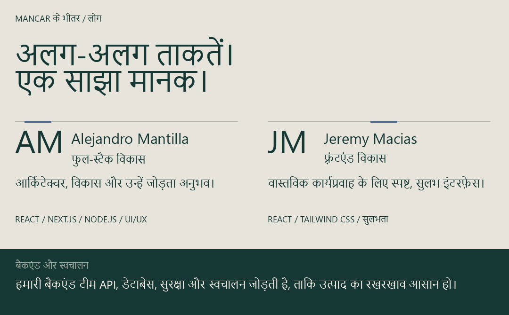
</picture>

Mancar में फुल-स्टैक विकास, फ़्रंटएंड और बैकएंड इंजीनियरिंग की क्षमताएँ मिलती हैं। Alejandro Mantilla तकनीकी आर्किटेक्चर को उपयोगकर्ता अनुभव से जोड़ते हैं। Jeremy Macias व्यावसायिक कार्यप्रवाहों को स्पष्ट और सुलभ इंटरफ़ेस में बदलते हैं। हमारी बैकएंड टीम उत्पाद को सहारा देने वाली सेवाएँ और स्वचालन विकसित करती है।

## हमारी संयुक्त क्षमताएँ

<picture>
  <source media="(prefers-reduced-motion: reduce) and (max-width: 600px)" srcset="assets/hi/mancar-disciplines-mobile.png" />
  <source media="(prefers-reduced-motion: reduce)" srcset="assets/hi/mancar-disciplines.png" />
  <source media="(max-width: 600px)" srcset="assets/hi/mancar-disciplines-mobile.gif" />
  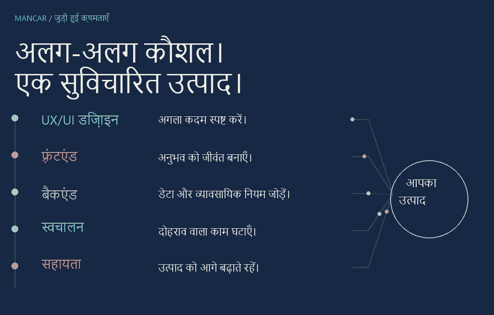
</picture>

UX/UI डिज़ाइन, फ़्रंटएंड विकास, बैकएंड इंजीनियरिंग, स्वचालन और सहायता का लक्ष्य एक है: व्यवसाय के अनुरूप और उपयोगकर्ताओं के लिए स्पष्ट उत्पाद। हर परियोजना में ज़रूरी क्षमताएँ जोड़ते हुए हम अनुभव और तकनीक के निर्णयों को साथ रखते हैं।

## हम कैसे काम करते हैं

<picture>
  <source media="(prefers-reduced-motion: reduce) and (max-width: 600px)" srcset="assets/hi/mancar-approach-mobile.png" />
  <source media="(prefers-reduced-motion: reduce)" srcset="assets/hi/mancar-approach.png" />
  <source media="(max-width: 600px)" srcset="assets/hi/mancar-approach-mobile.gif" />
  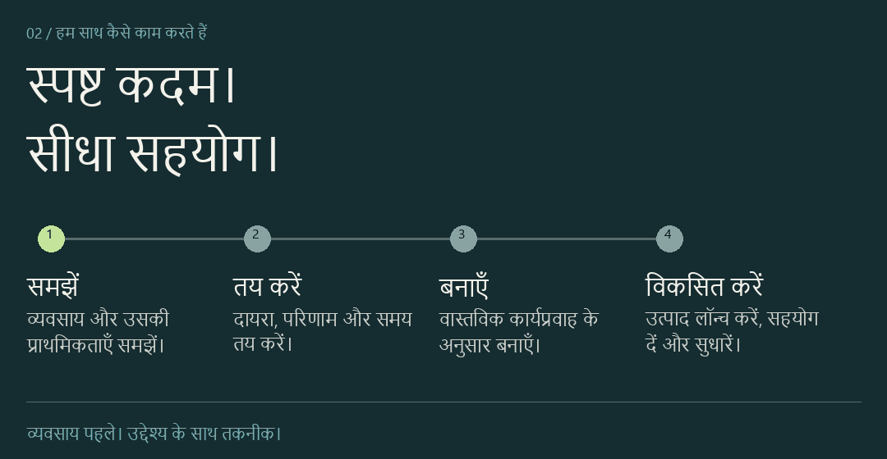
</picture>

विकास से पहले हम दायरा, प्राथमिकताएँ और समय तय करते हैं, फिर स्पष्ट निर्णयों के साथ दिखाई देने वाले चरणों में काम करते हैं। डिज़ाइन की गुणवत्ता, प्रदर्शन, सुरक्षा और रखरखाव की सुविधा लॉन्च तथा आगे की देखभाल का मार्गदर्शन करती हैं।

हम कार्यप्रवाह के अनुसार तकनीक चुनते हैं, और जहाँ काम की निरंतरता ज़रूरी हो वहाँ स्थानीय या LAN संचालन अपनाते हैं।

## विशेष परिचय: Casa Nativa

<picture>
  <source media="(prefers-reduced-motion: reduce) and (max-width: 600px)" srcset="assets/hi/mancar-casa-story-mobile.png" />
  <source media="(prefers-reduced-motion: reduce)" srcset="assets/hi/mancar-casa-story.png" />
  <source media="(max-width: 600px)" srcset="assets/hi/mancar-casa-story-mobile.gif" />
  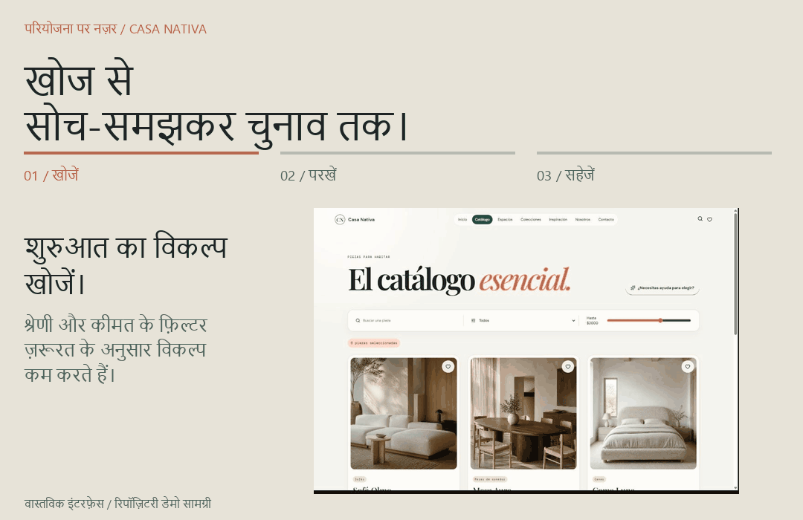
</picture>

फ़र्नीचर खरीदने वाले को केवल नाम नहीं, इतनी जानकारी चाहिए कि वह तय कर सके कि वस्तु उसके घर के लिए उपयुक्त है या नहीं। Casa Nativa ब्राउज़िंग, उत्पाद विवरण और सहेजे गए विकल्पों को एक अनुभव में जोड़ता है।

**ग्राहक का लक्ष्य:** विकल्प कम करना और समझना कि वस्तु स्थान में कैसे फिट होगी।

**इंटरफ़ेस का निर्णय:** तस्वीरों के साथ माप, सामग्री और रंग विकल्प दिखाना, तथा खोज में मदद के लिए कैटलॉग फ़िल्टर देना।

**तैयार सुविधा:** ग्राहक कैटलॉग देख सकते हैं, उत्पाद जाँच सकते हैं और पूछताछ से पहले वस्तुएँ “Mi espacio” में सहेज सकते हैं।

रिपॉज़िटरी से लिया गया इंटरफ़ेस · डेमो सामग्री · मूल इंटरफ़ेस स्पैनिश में

<a href="https://github.com/MancarSoftware/muebleria">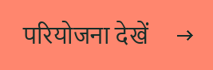</a>

## लॉन्च के बाद

<picture>
  <source media="(prefers-reduced-motion: reduce) and (max-width: 600px)" srcset="assets/hi/mancar-support-mobile.png" />
  <source media="(prefers-reduced-motion: reduce)" srcset="assets/hi/mancar-support.png" />
  <source media="(max-width: 600px)" srcset="assets/hi/mancar-support-mobile.gif" />
  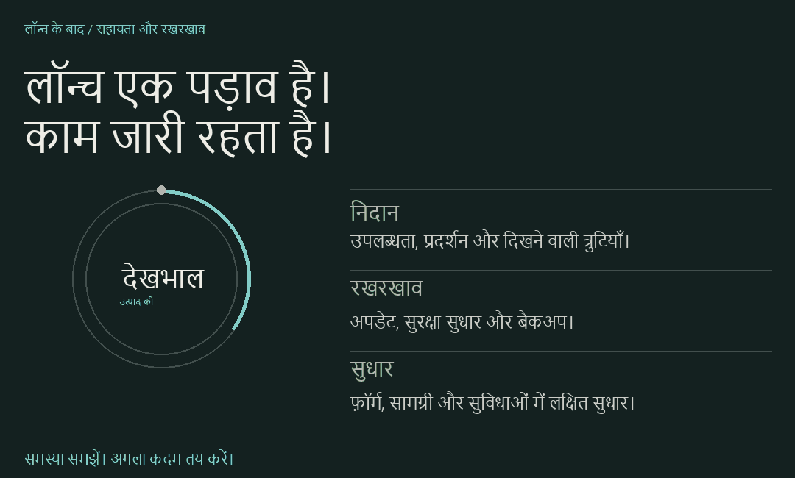
</picture>

व्यवसाय बदलने के साथ उत्पाद को भी ध्यान चाहिए। हमारी सहायता में उपलब्धता और प्रदर्शन की समस्याएँ, फ़ॉर्म और ईमेल भेजना, अपडेट, बैकअप तथा सामग्री या सुविधाओं में लक्षित सुधार शामिल हैं।

बदलाव से पहले हम संदर्भ समझते हैं और बिक्री, फ़ॉर्म या उपलब्धता को प्रभावित करने वाली समस्याओं को प्राथमिकता देते हैं। निदान के बाद कार्य और अगले कदम तय होते हैं।

**सहायता का समय:** सोमवार–शुक्रवार, सुबह 9:00–शाम 6:00, इक्वाडोर समय (UTC−5)।

<a href="https://ale-mancar.github.io/mancar_software/soporte/">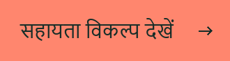</a>

## संपर्क करने के बाद क्या होता है?

<picture>
  <source media="(prefers-reduced-motion: reduce) and (max-width: 600px)" srcset="assets/hi/mancar-first-conversation-mobile.png" />
  <source media="(prefers-reduced-motion: reduce)" srcset="assets/hi/mancar-first-conversation.png" />
  <source media="(max-width: 600px)" srcset="assets/hi/mancar-first-conversation-mobile.gif" />
  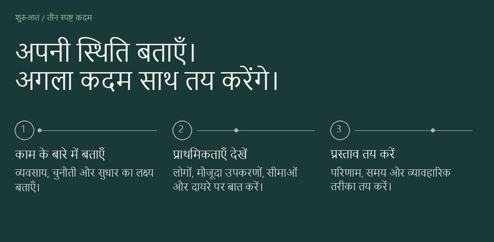
</picture>

अपने व्यवसाय की चुनौती, मौजूदा उत्पाद या सुधार का एक सरल उदाहरण साझा करें। इसी संदर्भ से हम काम का आकलन करके व्यावहारिक प्रस्ताव तैयार करेंगे।

## हमारे साथ काम करना

क्या आप मौजूदा उत्पाद को बेहतर बना सकते हैं?

हाँ। लक्षित सुधार सुझाने से पहले हम मौजूदा अनुभव, कार्यप्रवाह और तकनीकी संदर्भ की समीक्षा करते हैं।

संपर्क करने से पहले क्या तैयार करूँ?

शुरुआत के लिए व्यवसाय, हल की जाने वाली समस्या और प्राथमिकताओं का संक्षिप्त विवरण काफ़ी है। मौजूदा उत्पाद या उदाहरण हो तो साझा करें; तकनीकी विनिर्देश ज़रूरी नहीं हैं।

निरंतर सहायता की व्यवस्था कैसे होती है?

पहले हम समस्या और उसके प्रभाव की समीक्षा करते हैं, फिर कार्य और अगले कदम तय करते हैं। सहायता में उपलब्धता, प्रदर्शन, फ़ॉर्म, अपडेट, बैकअप या लक्षित सुधार शामिल हो सकते हैं। उत्पाद के लिए आवश्यक दायरे पर चर्चा करने के लिए संपर्क करें।

## बातचीत शुरू करें

<picture>
  <source media="(prefers-reduced-motion: reduce) and (max-width: 600px)" srcset="assets/hi/mancar-contact-mobile.png" />
  <source media="(prefers-reduced-motion: reduce)" srcset="assets/hi/mancar-contact.png" />
  <source media="(max-width: 600px)" srcset="assets/hi/mancar-contact-mobile.gif" />
  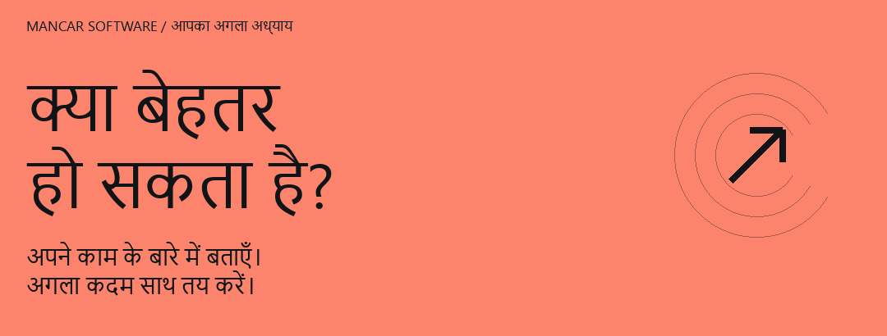
</picture>

<a href="https://ale-mancar.github.io/mancar_software/">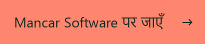</a>

MANCAR SOFTWARE · ग्वायाकिल, इक्वाडोर
