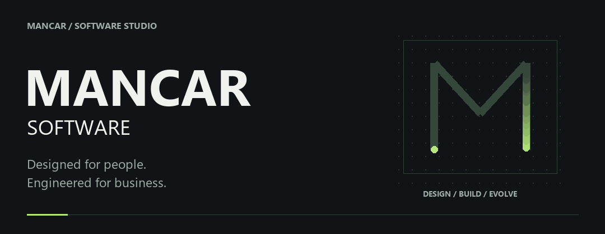
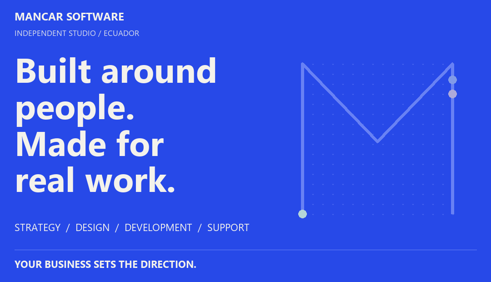
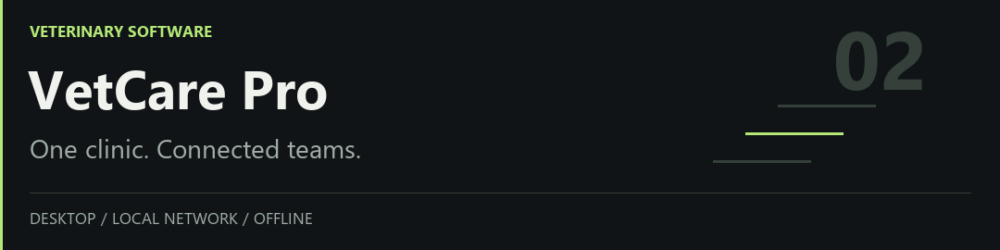
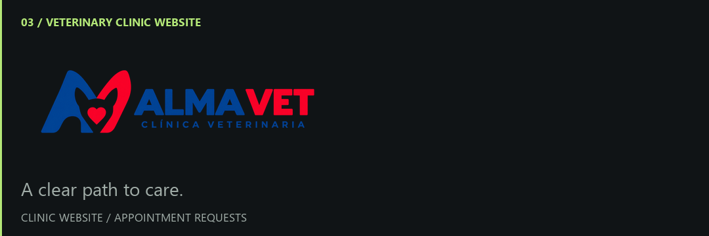
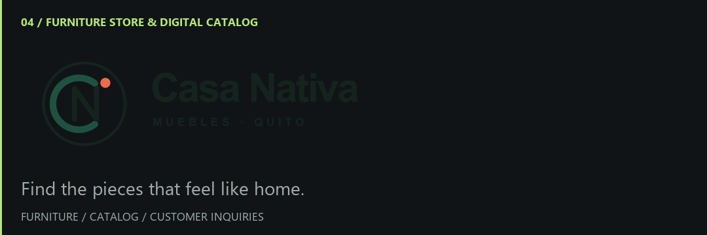
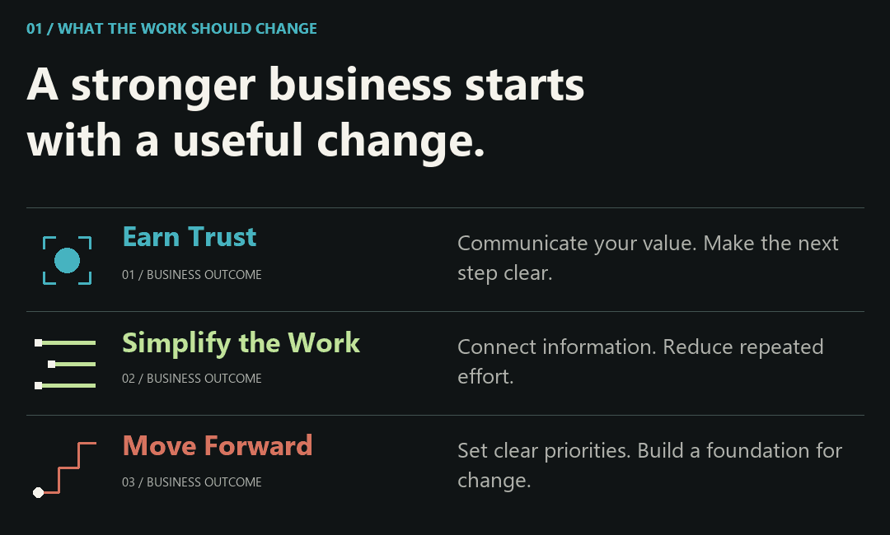
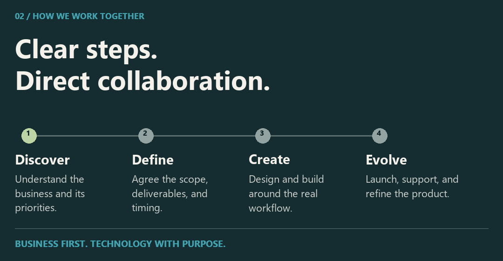
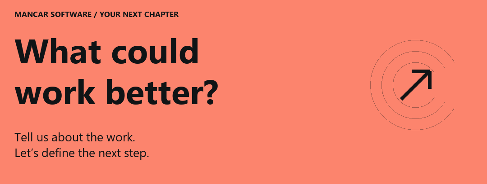

<picture>
  <source media="(prefers-reduced-motion: reduce)" srcset="assets/mancar-header-static.png" />
  
</picture>

**Your business has its own way of working. Your software should reflect it.**

Mancar Software designs websites, applications, and business systems around the people who use them—from the first customer inquiry to the work behind the scenes.

[Explore the projects ↓](#selected-work) &nbsp; / &nbsp; [Discuss your project ↗](https://www.instagram.com/mancarsoftware/)

## Selected work

<picture>
  <source media="(prefers-reduced-motion: reduce) and (max-width: 600px)" srcset="assets/mancar-studio-cover-mobile.png" />
  <source media="(prefers-reduced-motion: reduce)" srcset="assets/mancar-studio-cover.png" />
  <source media="(max-width: 600px)" srcset="assets/mancar-studio-cover-mobile.gif" />
  
</picture>

[01 OdontoCare](#odontocare) &nbsp; / &nbsp; [02 VetCare Pro](#vetcare-pro) &nbsp; / &nbsp; [03 Alma Vet](#alma-vet) &nbsp; / &nbsp; [04 Casa Nativa](#casa-nativa)

### OdontoCare

<a href="https://github.com/MancarSoftware/odonto_care">
<picture>
  <source media="(max-width: 600px)" srcset="assets/project-odontocare-mobile.png" />
  
</picture>
</a>

Patient records, appointments, treatments, and payments in a Windows application that works offline.

**For:** dental clinics managing clinical and administrative work in one place.

**Inside the product:** patient histories, appointments, odontograms, treatments, payments, inventory, and reporting. Its documented workflows also cover roles, audit records, backups, and restoration.

**Built with:** Electron, React, TypeScript, NestJS, PostgreSQL, and Prisma.

Deployment and engineering details

Designed as an installable Windows application with local PostgreSQL storage. The production installer manages the application services so the clinic can work offline. The repository documents verification for critical workflows, packaging, backup restoration, and installation.

[Explore OdontoCare →](https://github.com/MancarSoftware/odonto_care)

[Read the user guide](https://github.com/MancarSoftware/odonto_care/blob/main/docs/USER_GUIDE.md) · [Review the release checklist](https://github.com/MancarSoftware/odonto_care/blob/main/docs/RELEASE_CHECKLIST.md)

### VetCare Pro

<a href="https://github.com/MancarSoftware/vetCarePro">
<picture>
  <source media="(max-width: 600px)" srcset="assets/project-vetcare-mobile.png" />
  
</picture>
</a>

Veterinary software for a single PC or a connected clinic, with records and payments available over the local network.

**For:** veterinary teams working from one computer or several computers in the same clinic.

**Inside the product:** pet records, clinical histories, appointments, vaccines, treatments, images, and payments. Local network operation lets reception, veterinary staff, and the payment desk work with the shared system.

**Built with:** Electron, Node.js, and PostgreSQL.

Deployment and engineering details

Supports standalone, LAN server, and LAN client modes on Windows. One computer hosts the local services and data; the others connect over the clinic's network. Internet access is not required for this local workflow. The repository includes installation, network configuration, and backup guidance.

[Explore VetCare Pro →](https://github.com/MancarSoftware/vetCarePro)

[Review the LAN test plan](https://github.com/MancarSoftware/vetCarePro/blob/main/docs/release-1.1-lan-test-plan.md) · [Read the setup guide](https://github.com/MancarSoftware/vetCarePro#readme)

### Alma Vet

<a href="https://github.com/MancarSoftware/veterinaria">
<picture>
  <source media="(max-width: 600px)" srcset="assets/project-almavet-mobile.png" />
  
</picture>
</a>

A veterinary clinic website that connects pet owners with the clinic through a structured appointment-request process.

**For:** Alma Vet veterinary clinic and pet owners requesting care.

**Inside the project:** a React website with an appointment-request flow, server-side validation, bot protection, request storage, and email notifications. Requests are submitted for review; they do not automatically confirm an appointment.

**Built with:** React, Supabase, PostgreSQL, Cloudflare Turnstile, and Resend.

[Explore Alma Vet →](https://github.com/MancarSoftware/veterinaria)

[Read the architecture and setup guide](https://github.com/MancarSoftware/veterinaria#readme)

### Casa Nativa

<a href="https://github.com/MancarSoftware/muebleria">
<picture>
  <source media="(max-width: 600px)" srcset="assets/project-casanativa-mobile.png" />
  
</picture>
</a>

A furniture store website with an editable catalog, color variants, and customer inquiry workflows.

**For:** Casa Nativa furniture store and customers exploring pieces for their homes.

**Inside the project:** a furniture catalog with product images and color variants, an administration area for publishing products, and tools for space proposals and customer inquiries.

**Built with:** React, TypeScript, Vite, and Supabase.

[Explore Casa Nativa →](https://github.com/MancarSoftware/muebleria)

[Read the catalog and administration guide](https://github.com/MancarSoftware/muebleria#readme)

<picture>
  <source media="(prefers-reduced-motion: reduce) and (max-width: 600px)" srcset="assets/mancar-capabilities-mobile.png" />
  <source media="(prefers-reduced-motion: reduce)" srcset="assets/mancar-capabilities.png" />
  <source media="(max-width: 600px)" srcset="assets/mancar-capabilities-mobile.gif" />
  
</picture>

## Capabilities

**Build your digital presence.** Corporate websites, landing pages, and catalogs that explain your services, express your identity, and guide visitors toward an inquiry. Responsive layouts and clear content help people find what matters on any screen.

**Bring your operations together.** Business applications for records, appointments, inventory, payments, and reporting. We shape the workflow around the people doing the work, with roles and access appropriate to each responsibility.

**Create a product around a specific need.** Custom web applications and desktop software that connect interfaces, business logic, and data. The scope can include authentication, APIs, and integrations with existing tools.

Where the software runs

- **Web:** for products and experiences accessed through a browser.
- **Local desktop:** for work on a dedicated computer, including workflows that need to operate offline.
- **Local network:** for teams sharing a system across computers at the same location.

We choose the setup around connectivity, access, data handling, and maintenance needs. Our featured clinical products demonstrate local and LAN approaches; deployment requirements are defined for each project.

<picture>
  <source media="(prefers-reduced-motion: reduce) and (max-width: 600px)" srcset="assets/mancar-approach-mobile.png" />
  <source media="(prefers-reduced-motion: reduce)" srcset="assets/mancar-approach.png" />
  <source media="(max-width: 600px)" srcset="assets/mancar-approach-mobile.gif" />
  
</picture>

## Working together

**01 / Define the right scope.** Start with the business goal, the users, and the current workflow. Identify the essential features, constraints, integrations, and what a successful first release needs to achieve.

**02 / Make the experience concrete.** Organize the information and map the important user journeys. Establish a visual direction and review the key screens before expanding the implementation.

**03 / Build in useful increments.** Develop around complete workflows, with clear responsibilities in the code and feedback as the product takes shape. Add complexity when the requirements justify it.

**04 / Validate and prepare delivery.** Check the critical paths, permissions, error handling, and deployment setup. Define the installation and operating documentation needed for the agreed environment.

What we plan for beyond the first release

- **Maintainability:** readable code, clear boundaries, and documented setup.
- **Usability:** accessible interaction, useful feedback, and recovery from errors.
- **Data protection:** input validation, appropriate access controls, and backup planning where relevant.
- **Performance:** attention to real loading, rendering, and data-access bottlenecks.
- **Handover:** installation, configuration, and operating instructions appropriate to the product.

Hosting, ongoing maintenance, future features, and support arrangements belong in the project scope so expectations are clear from the beginning.

## Decisions that shape the product

**Connectivity is a requirement.** A public website and a clinic's internal system have different needs. We consider where people work, how they connect, and what must remain available when the internet is down.

**Recovery belongs in the plan.** Installation, backups, updates, and operating instructions affect the usefulness of a business system as much as its screens. The clinical project guides above make these concerns concrete.

**Design continues after the first screen.** Navigation, validation, empty states, and feedback deserve the same attention as the opening impression. The aim is a product people can understand and keep using.

## Our toolkit

A focused ecosystem reflected in the projects above. We choose tools around the product’s needs, deployment environment, and long-term maintenance.

**Interface** &nbsp; React · TypeScript · JavaScript · Tailwind CSS 
**Application** &nbsp; Node.js · NestJS · Electron 
**Foundation** &nbsp; PostgreSQL · Prisma · Docker · Git

## Before we start

Do I need a complete specification?

Start with the problem, the people affected, and an example of how the work happens today. Screenshots, spreadsheets, or a description of your existing process can help shape the first scope.

Can the software work with our existing tools?

We first review the available APIs, data formats, access permissions, and workflow. Integration and data migration need to be scoped around what those systems actually support.

What determines the timeline and budget?

The critical workflows, design scope, integrations, data migration, and deployment environment. Sharing a target date and budget range helps define a realistic first release and what can follow later.

What happens after delivery?

Maintenance, hosting, updates, and support responsibilities are defined in the project scope. They should be clear before development starts, alongside the documentation and handover requirements.

<a href="https://www.instagram.com/mancarsoftware/">
<picture>
  <source media="(prefers-reduced-motion: reduce) and (max-width: 600px)" srcset="assets/mancar-contact-mobile.png" />
  <source media="(prefers-reduced-motion: reduce)" srcset="assets/mancar-contact.png" />
  <source media="(max-width: 600px)" srcset="assets/mancar-contact-mobile.gif" />
  
</picture>
</a>

## Start with the problem

Tell us what your business does, who will use the software, and what is difficult today. A rough idea is enough to start the conversation.

Helpful details include the features you have in mind, existing tools or data, whether the product needs to work locally or online, and your target timeline and budget range.

**For developers and collaborators:** explore the repositories for stack choices, setup instructions, and implementation details. For a collaboration proposal, introduce your area of expertise and the project you would like to discuss.

[Discuss a project on Instagram →](https://www.instagram.com/mancarsoftware/) &nbsp; / &nbsp; [Browse our repositories](https://github.com/MancarSoftware?tab=repositories)

MANCAR SOFTWARE · Designed for people. Engineered for business.
