# Mancar Software

## Software shaped around your business.

We design and build websites, web applications, and custom business systems for companies and SMEs. Clear interfaces, dependable engineering, and room to grow—built around the way your business works.

[What we build](#what-we-build) · [Selected work](#selected-work) · [Work with us](#work-with-us)

## What we build

### Web experiences
Corporate websites, landing pages, and digital catalogs that help people understand your offer and take the next step.

### Business systems
Tools that bring everyday operations into one place, reduce repetitive work, and make information easier to act on.

### Web applications
Connected products with thoughtful interfaces, backend services, databases, authentication, and APIs.

### Custom software
Purpose-built solutions for workflows that off-the-shelf tools cannot comfortably support.

## Selected work

Portfolio entries are being prepared. The names below are candidate projects; scope, availability, and repository links are pending confirmation.

### 01 / OdontoCare
**Project details pending confirmation.**

<!-- Replace with a verified one-sentence description, actual technology stack, and a meaningful repository or case-study link. -->
Repository / case study: `TODO_ODONTOCARE_URL`

### 02 / VetCare Pro
**Project details pending confirmation.**

<!-- Replace with a verified one-sentence description, actual technology stack, and a meaningful repository or case-study link. -->
Repository / case study: `TODO_VETCARE_PRO_URL`

### 03 / GymCare
**Project details pending confirmation.**

<!-- Replace with a verified one-sentence description, actual technology stack, and a meaningful repository or case-study link. Duplicate this section to add another project. -->
Repository / case study: `TODO_GYMCARE_URL`

## How we build

**Understand the work first.** Start with the people, constraints, and business problem before choosing a stack.

**Make every interaction count.** Treat usability, accessibility, and performance as part of product quality.

**Keep the foundations clear.** Favor maintainable architecture, readable code, and complexity that earns its place.

**Build for the next step.** Validate critical workflows and leave room for the product to evolve.

## Technology

A focused toolkit, chosen to fit each project.

<!-- Suggested ecosystem from the brief. Confirm these technologies before publishing as the company's established stack. -->
*Proposed ecosystem — pending confirmation.*

- **Interface:** React, Next.js, TypeScript, Tailwind CSS
- **Services:** Node.js, Express
- **Data:** PostgreSQL, MySQL
- **Delivery:** Git, GitHub, Docker, CI/CD

## Work with us

**Tell us what your business needs to do better.**

A new product, a clearer web presence, or a workflow ready for better software: start with the problem, the people using it, and what success would look like.

Contact channels are awaiting confirmation. Replace the following placeholders before publishing:

- **Website:** `TODO_WEBSITE_URL`
- **Email:** `TODO_CONTACT_EMAIL`
- **LinkedIn:** `TODO_LINKEDIN_URL`
- **Instagram:** `TODO_INSTAGRAM_URL`
- **WhatsApp:** `TODO_WHATSAPP_URL`

---

Mancar Software · Thoughtful interfaces. Dependable foundations.
