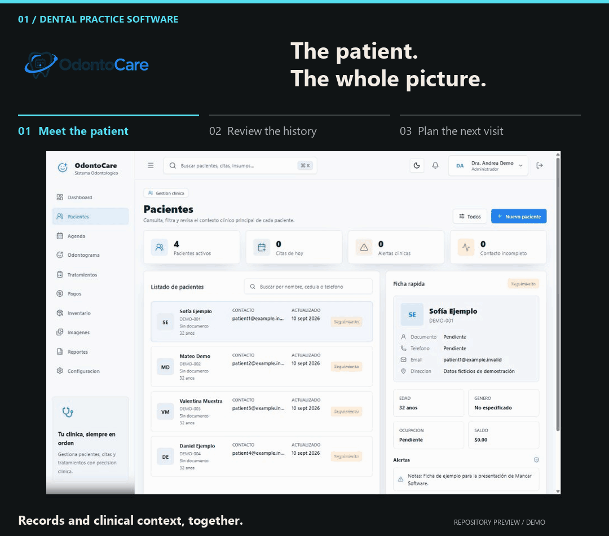
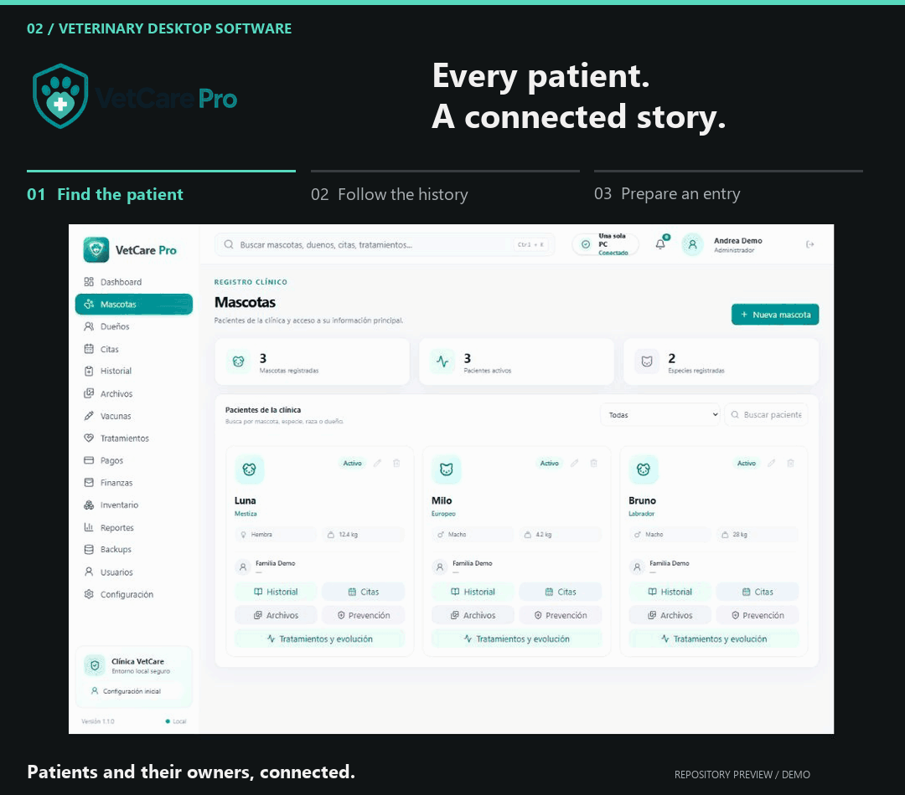
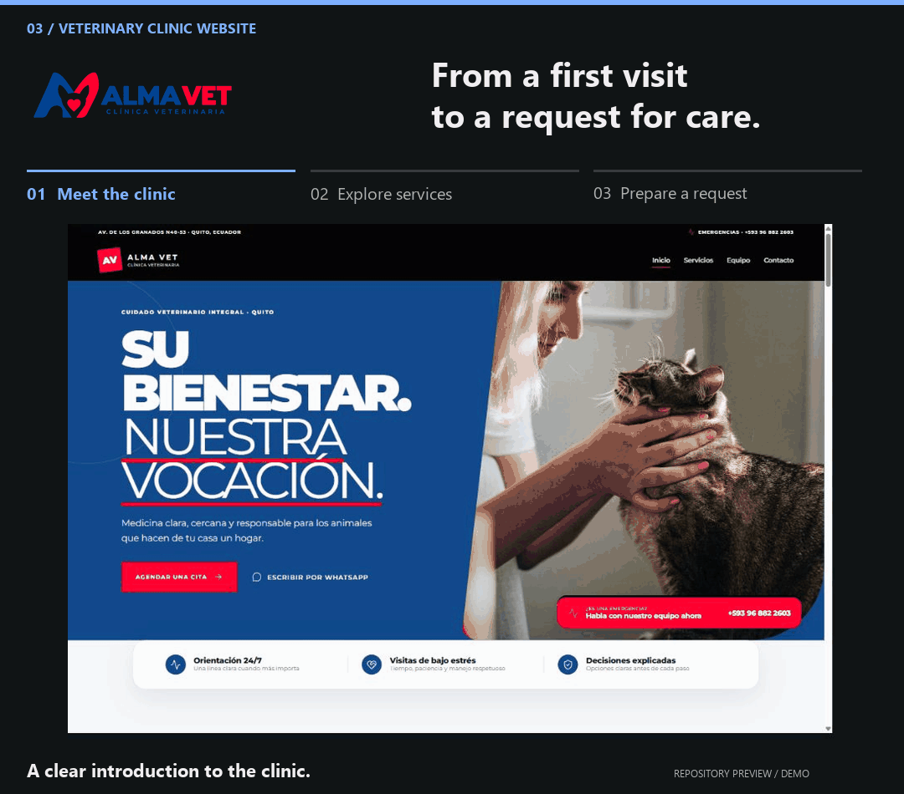
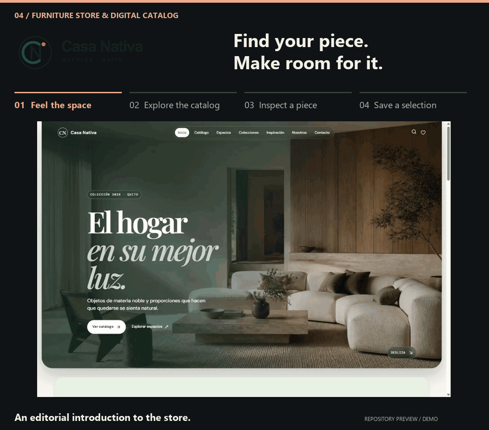
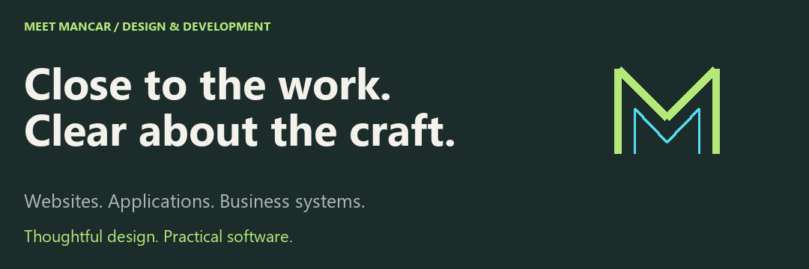

<picture>
  <source media="(prefers-reduced-motion: reduce)" srcset="assets/mancar-header-static.png" />
  
</picture>

**Every business works differently. Its software should, too.**

Mancar Software designs and develops websites, applications, and business systems around real users and real workflows—from the first customer inquiry to the daily work behind the scenes.

[Explore the projects ↓](#selected-work) &nbsp; / &nbsp; [Discuss your project ↗](https://www.instagram.com/mancarsoftware/)

## Selected Work

<picture>
  <source media="(prefers-reduced-motion: reduce) and (max-width: 600px)" srcset="assets/mancar-studio-cover-mobile.png" />
  <source media="(prefers-reduced-motion: reduce)" srcset="assets/mancar-studio-cover.png" />
  <source media="(max-width: 600px)" srcset="assets/mancar-studio-cover-mobile.gif" />
  
</picture>

[01 OdontoCare](#odontocare) &nbsp; / &nbsp; [02 VetCare Pro](#vetcare-pro) &nbsp; / &nbsp; [03 Alma Vet](#alma-vet) &nbsp; / &nbsp; [04 Casa Nativa](#casa-nativa)

### OdontoCare

<a href="https://github.com/MancarSoftware/odonto_care">
<picture>
  <source media="(prefers-reduced-motion: reduce) and (max-width: 600px)" srcset="assets/project-odontocare-mobile.png" />
  <source media="(prefers-reduced-motion: reduce)" srcset="assets/project-odontocare.png" />
  <source media="(max-width: 600px)" srcset="assets/project-odontocare-mobile.gif" />
  
</picture>
</a>

An offline-ready Windows application for managing patient records, appointments, treatments, and payments.

Interface captured from the repository · Fictional clinical data · Original interface in Spanish

[View the still-image tour](../docs/PROJECT-GALLERY.md#odontocare) &nbsp; / &nbsp; [Explore the repository →](https://github.com/MancarSoftware/odonto_care)

**Designed For:** dental clinics managing clinical and administrative work in one place.

**Core Functionality:** patient histories, appointments, odontograms, treatments, payments, inventory, and reporting. The documented workflows also cover user roles, audit records, backups, and restoration.

**Built With:** Electron, React, TypeScript, NestJS, PostgreSQL, and Prisma.

Deployment and Engineering Details

Designed as an installable Windows application with local PostgreSQL storage. The production installer manages the required application services, allowing the clinic to work offline. The repository documents verification procedures for critical workflows, packaging, backup restoration, and installation.

[Read the user guide](https://github.com/MancarSoftware/odonto_care/blob/main/docs/USER_GUIDE.md) · [Review the release checklist](https://github.com/MancarSoftware/odonto_care/blob/main/docs/RELEASE_CHECKLIST.md)

### VetCare Pro

<a href="https://github.com/MancarSoftware/vetCarePro">
<picture>
  <source media="(prefers-reduced-motion: reduce) and (max-width: 600px)" srcset="assets/project-vetcare-mobile.png" />
  <source media="(prefers-reduced-motion: reduce)" srcset="assets/project-vetcare.png" />
  <source media="(max-width: 600px)" srcset="assets/project-vetcare-mobile.gif" />
  
</picture>
</a>

Veterinary practice software for standalone and local network environments, with clinical records, scheduling, and payments accessible across the clinic.

Interface captured from the repository · Fictional clinical data · Original interface in Spanish

[View the still-image tour](../docs/PROJECT-GALLERY.md#vetcare-pro) &nbsp; / &nbsp; [Explore the repository →](https://github.com/MancarSoftware/vetCarePro)

**Designed For:** veterinary teams working from a single computer or across several computers in the same clinic.

**Core Functionality:** patient records, clinical histories, appointments, vaccinations, treatments, images, and payments. Local network support allows reception, veterinary staff, and the payment desk to access the same system.

**Built With:** Electron, Node.js, and PostgreSQL.

Deployment and Engineering Details

Supports standalone, LAN server, and LAN client modes on Windows. One computer hosts the local services and data, while the others connect through the clinic's network. This local workflow does not require internet access. The repository includes guidance for installation, network configuration, and backups.

[Review the LAN test plan](https://github.com/MancarSoftware/vetCarePro/blob/main/docs/release-1.1-lan-test-plan.md) · [Read the setup guide](https://github.com/MancarSoftware/vetCarePro#readme)

### Alma Vet

<a href="https://github.com/MancarSoftware/veterinaria">
<picture>
  <source media="(prefers-reduced-motion: reduce) and (max-width: 600px)" srcset="assets/project-almavet-mobile.png" />
  <source media="(prefers-reduced-motion: reduce)" srcset="assets/project-almavet.png" />
  <source media="(max-width: 600px)" srcset="assets/project-almavet-mobile.gif" />
  
</picture>
</a>

A veterinary clinic website that guides pet owners from service discovery to a structured appointment request.

Interface captured from the repository · Repository demo content · Original interface in Spanish

[View the still-image tour](../docs/PROJECT-GALLERY.md#alma-vet) &nbsp; / &nbsp; [Explore the repository →](https://github.com/MancarSoftware/veterinaria)

**Designed For:** the Alma Vet clinic and pet owners requesting care.

**Core Functionality:** service discovery and structured appointment requests, supported by server-side validation, bot protection, persistent request storage, and email notifications. Each request is submitted for review and does not automatically confirm an appointment.

**Built With:** React, Supabase, PostgreSQL, Cloudflare Turnstile, and Resend.

[Read the architecture and setup guide](https://github.com/MancarSoftware/veterinaria#readme)

### Casa Nativa

<a href="https://github.com/MancarSoftware/muebleria">
<picture>
  <source media="(prefers-reduced-motion: reduce) and (max-width: 600px)" srcset="assets/project-casanativa-mobile.png" />
  <source media="(prefers-reduced-motion: reduce)" srcset="assets/project-casanativa.png" />
  <source media="(max-width: 600px)" srcset="assets/project-casanativa-mobile.gif" />
  
</picture>
</a>

A furniture retail website with an editable catalog, color variants, and structured customer inquiry workflows.

Interface captured from the repository · Repository demo content · Original interface in Spanish

[View the still-image tour](../docs/PROJECT-GALLERY.md#casa-nativa) &nbsp; / &nbsp; [Explore the repository →](https://github.com/MancarSoftware/muebleria)

**Designed For:** Casa Nativa and customers exploring furniture for their homes.

**Core Functionality:** a furniture catalog with product photography and color variants, an administration area for publishing products, and tools for space proposals and customer inquiries.

**Built With:** React, TypeScript, Vite, and Supabase.

[Read the catalog and administration guide](https://github.com/MancarSoftware/muebleria#readme)

<picture>
  <source media="(prefers-reduced-motion: reduce) and (max-width: 600px)" srcset="assets/mancar-capabilities-mobile.png" />
  <source media="(prefers-reduced-motion: reduce)" srcset="assets/mancar-capabilities.png" />
  <source media="(max-width: 600px)" srcset="assets/mancar-capabilities-mobile.gif" />
  
</picture>

## Capabilities

**Build a Clear Digital Presence.** Corporate websites, landing pages, and catalogs that explain your services, express your identity, and guide visitors toward an inquiry. Responsive layouts and focused content make essential information easy to find on any screen.

**Bring Your Operations Together.** Business applications for records, appointments, inventory, payments, and reporting. We shape each workflow around the people doing the work, with access aligned to their responsibilities.

**Create Software for a Specific Need.** Custom web applications and desktop software that connect interfaces, business logic, and data. The scope may include authentication, APIs, and integrations with existing tools.

Where the Software Runs

- **Web:** browser-based products and digital experiences.
- **Local desktop:** dedicated applications, including workflows that must remain available offline.
- **Local network:** shared systems for teams working across several computers at one location.

We select the deployment model according to connectivity, access, data handling, and maintenance requirements. The featured clinical applications illustrate both local and LAN-based approaches; the final deployment is defined for each project.

## Working Together

**01 / Define the Right Scope.** Begin with the business objective, the users, and the current workflow. Identify the essential features, constraints, integrations, and outcomes required for a successful first release.

**02 / Make the Experience Concrete.** Organize the information and map the critical user journeys. Establish a visual direction and review the key screens before expanding the implementation.

**03 / Build in Meaningful Increments.** Develop complete workflows with clear responsibilities in the code, gathering feedback as the product takes shape. Add complexity only when the requirements justify it.

**04 / Validate and Prepare for Delivery.** Verify critical paths, permissions, error handling, and the deployment setup. Prepare the installation and operational documentation required for the agreed environment.

What We Plan for Beyond the First Release

- **Maintainability:** readable code, clear boundaries, and documented setup.
- **Usability:** accessible interaction, useful feedback, and recovery from errors.
- **Data protection:** input validation, appropriate access controls, and backup planning where relevant.
- **Performance:** measured attention to loading time, rendering, and data access.
- **Handover:** installation, configuration, and operating instructions appropriate to the product.

Hosting, ongoing maintenance, future features, and support arrangements are defined in the project scope so expectations remain clear from the outset.

## Decisions That Shape the Product

**Connectivity Is an Architectural Requirement.** A public website and a clinic's internal system have different needs. We consider where people work, how they connect, and which functions must remain available when the internet is down.

**Recovery Belongs in the Plan.** Installation, backups, updates, and operational guidance affect the reliability of a business system as much as its interface does. The clinical project guides above make these considerations concrete.

**Design Extends Beyond the First Screen.** Navigation, validation, empty states, and feedback deserve the same attention as the initial impression. The goal is a product people can understand, trust, and continue using.

## Meet Mancar

<picture>
  <source media="(max-width: 600px)" srcset="assets/mancar-studio-mobile.png" />
  
</picture>

Mancar Software connects two sides of a business: the experience customers see and the systems a team relies on behind the scenes. The four projects above reflect that focus—from a furniture catalog and a veterinary clinic website to applications that support daily clinical operations.

Our approach begins with the people, the workflow, and the problem. We bring design and development into the same conversation, make the essential screens concrete, and build toward a focused first release.

**To discuss a project:** describe the challenge you are facing. **To propose a collaboration:** share your work and explain where you would like to contribute.

## Our Toolkit

A focused technology ecosystem reflected in the projects above. We select tools according to product requirements, the deployment environment, and long-term maintenance needs.

**Interface** &nbsp; React · TypeScript · JavaScript · Tailwind CSS 
**Application** &nbsp; Node.js · NestJS · Electron 
**Foundation** &nbsp; PostgreSQL · Prisma · Docker · Git

## Before We Start

Do I need a complete specification?

Begin with the problem, the people affected, and an example of how the work is handled today. Screenshots, spreadsheets, or a description of the current process can help define the initial scope.

Can the software work with our existing tools?

We first review the available APIs, data formats, access permissions, and workflows. Integration and data migration are then scoped according to what those systems support.

What determines the timeline and budget?

The timeline and budget depend on the critical workflows, design scope, integrations, data migration, and deployment environment. A target date and budget range help define a realistic first release and a practical roadmap for later phases.

What happens after delivery?

Maintenance, hosting, updates, and support responsibilities are defined in the project scope. These responsibilities, together with documentation and handover requirements, should be clear before development begins.

<a href="https://www.instagram.com/mancarsoftware/">
<picture>
  <source media="(prefers-reduced-motion: reduce) and (max-width: 600px)" srcset="assets/mancar-contact-mobile.png" />
  <source media="(prefers-reduced-motion: reduce)" srcset="assets/mancar-contact.png" />
  <source media="(max-width: 600px)" srcset="assets/mancar-contact-mobile.gif" />
  
</picture>
</a>

## What Does Your Team Still Manage Manually?

An appointment schedule, a spreadsheet, a product inquiry, or any task that requires entering the same information more than once. Tell us where the process becomes difficult and who it affects.

**Start With One Message:** “We run a [type of business]. Today, we manage [task] with [current tool]. We want to make [desired outcome] easier.”

Helpful context includes the features you have in mind, existing tools or data, whether the product must work locally or online, and your target timeline and budget range.

**For Developers and Collaborators:** explore the repositories for technology choices, setup instructions, and implementation details. When proposing a collaboration, introduce your area of expertise and the project you would like to discuss.

[Discuss your project on Instagram →](https://www.instagram.com/mancarsoftware/) &nbsp; / &nbsp; [Browse our repositories](https://github.com/MancarSoftware?tab=repositories)

MANCAR SOFTWARE · Designed for people. Engineered for business.
