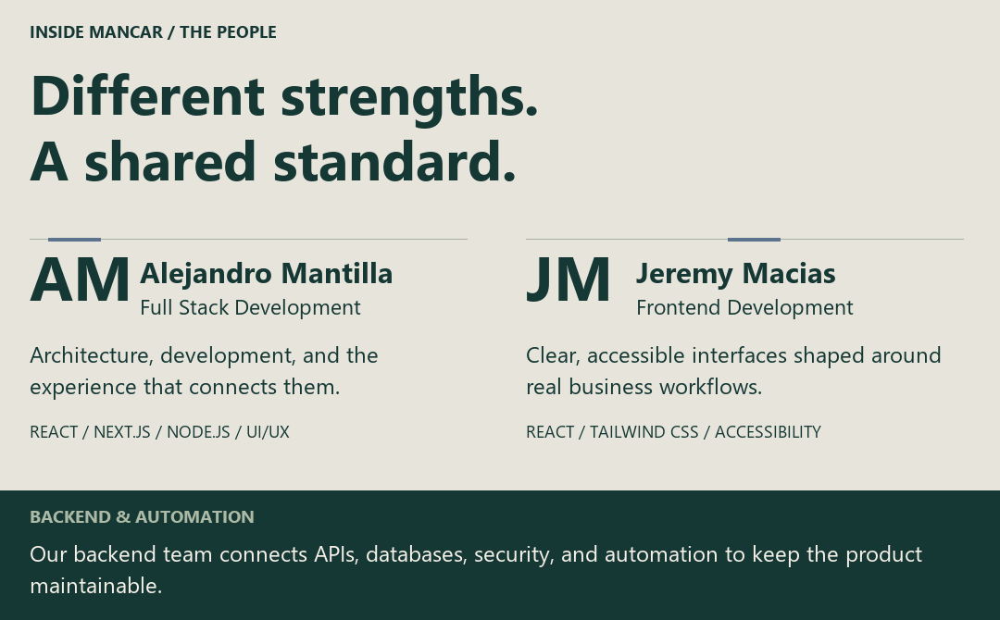
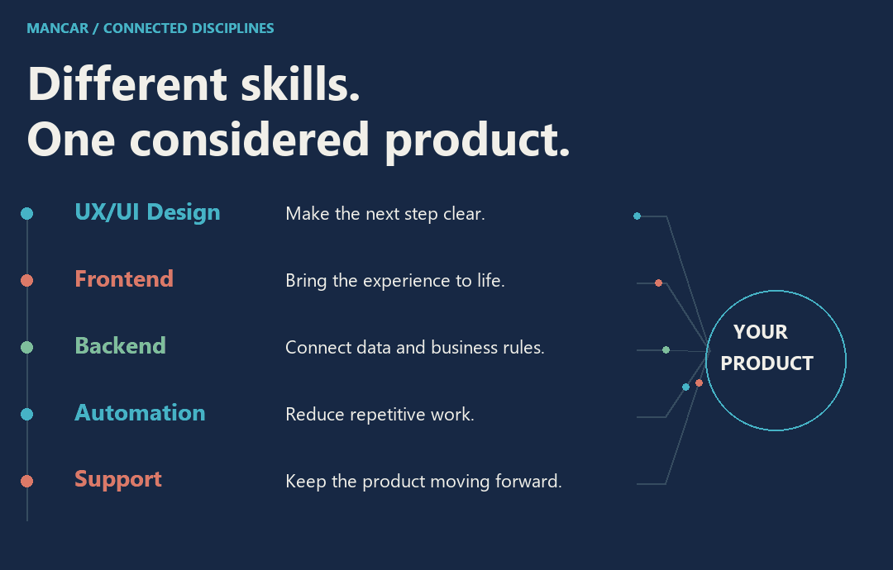
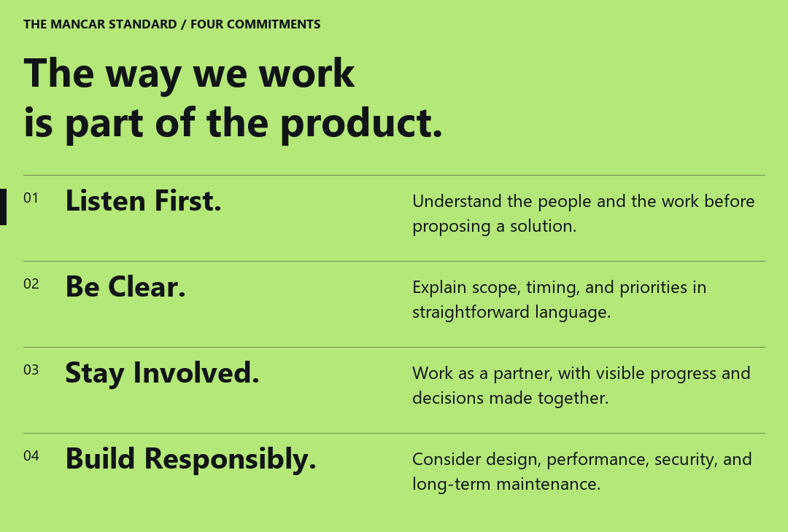
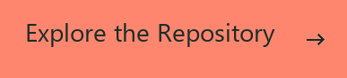
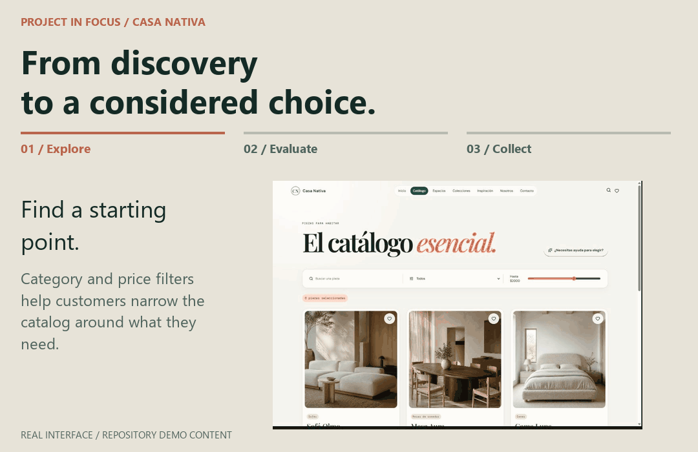
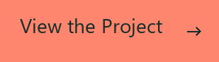
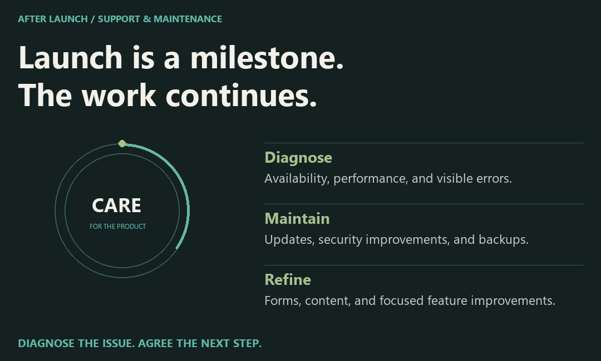
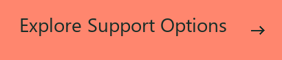
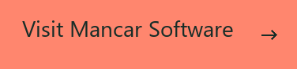

<picture>
  <source media="(prefers-reduced-motion: reduce) and (max-width: 600px)" srcset="assets/mancar-studio-cover-mobile.png" />
  <source media="(prefers-reduced-motion: reduce)" srcset="assets/mancar-studio-cover.png" />
  <source media="(max-width: 600px)" srcset="assets/mancar-studio-cover-mobile.gif" />
  
</picture>

# Mancar Software

We bring strategy, design, and development together to help businesses earn trust, simplify daily work, and build for what comes next. Based in Guayaquil, Ecuador, we work directly with the people behind each business, from the first conversation through launch and ongoing support.

What We Bring to a Project

We define the business need before choosing the technology. Our work spans digital experiences, product catalogs, desktop and local-network applications, workflow automation, and technical support. Every project starts with the people who will use it, the information they need, and the decisions it should make easier.

We prioritize a clear experience, dependable operation, and a foundation that can evolve as the business changes.

## The People Behind Mancar

<picture>
  <source media="(prefers-reduced-motion: reduce) and (max-width: 600px)" srcset="assets/mancar-team-mobile.png" />
  <source media="(prefers-reduced-motion: reduce)" srcset="assets/mancar-team.png" />
  <source media="(max-width: 600px)" srcset="assets/mancar-team-mobile.gif" />
  
</picture>

Mancar brings together full stack development, frontend craft, and backend engineering. Alejandro Mantilla connects technical architecture with the user experience. Jeremy Macias turns business workflows into clear, accessible interfaces. Our backend team develops the services and automation that support the product.

## What We Bring Together

<picture>
  <source media="(prefers-reduced-motion: reduce) and (max-width: 600px)" srcset="assets/mancar-disciplines-mobile.png" />
  <source media="(prefers-reduced-motion: reduce)" srcset="assets/mancar-disciplines.png" />
  <source media="(max-width: 600px)" srcset="assets/mancar-disciplines-mobile.gif" />
  
</picture>

UX/UI design, frontend development, backend engineering, automation, and support contribute to the same goal: a product that fits the business and is clear for the people using it. We bring in the disciplines each project needs, with decisions connected across the experience and the technology behind it.

## What We Help Improve

<picture>
  <source media="(prefers-reduced-motion: reduce) and (max-width: 600px)" srcset="assets/mancar-capabilities-mobile.png" />
  <source media="(prefers-reduced-motion: reduce)" srcset="assets/mancar-capabilities.png" />
  <source media="(max-width: 600px)" srcset="assets/mancar-capabilities-mobile.gif" />
  
</picture>

What These Outcomes Mean for Your Business

**More Confidence.** A clear public presence, useful content, and direct paths from interest to conversation help a business communicate its value from the first visit.

**Less Manual Work.** Focused tools centralize the details that teams need, reduce repetitive tasks, and make daily operations easier to follow.

**Better Follow-Through.** Work progresses through clear stages, visible decisions, and plain-language communication, so the next step is always understood.

## How We Work

<picture>
  <source media="(prefers-reduced-motion: reduce) and (max-width: 600px)" srcset="assets/mancar-approach-mobile.png" />
  <source media="(prefers-reduced-motion: reduce)" srcset="assets/mancar-approach.png" />
  <source media="(max-width: 600px)" srcset="assets/mancar-approach-mobile.gif" />
  
</picture>

From the First Conversation to Ongoing Support

1. **Diagnose.** We review the business, its priorities, the people involved, and the outcome that matters most.
2. **Define a Clear Proposal.** We agree the scope, deliverables, timing, and implementation route before development begins.
3. **Design and Develop.** We shape a usable experience around the brand, the workflow, and the people using it.
4. **Launch and Evolve.** We test, publish or install, and remain available for support, refinement, and the next stage of the work.

**Built to Fit the Work**

We choose technology in proportion to the job: a lean public presence where clarity and speed matter, a catalog when products need to be explored, or a desktop and local-network application when a team needs continuity and control. We do not add complexity for its own sake.

The selected projects below make that approach concrete: two Windows applications for clinical teams, a veterinary clinic experience, and a furniture catalog built around real customer inquiries.

## What You Can Expect From Us

<picture>
  <source media="(prefers-reduced-motion: reduce) and (max-width: 600px)" srcset="assets/mancar-principles-mobile.png" />
  <source media="(prefers-reduced-motion: reduce)" srcset="assets/mancar-principles.png" />
  <source media="(max-width: 600px)" srcset="assets/mancar-principles-mobile.gif" />
  
</picture>

We listen before proposing, explain technical decisions in plain language, and work in stages so you can see progress and understand what comes next. Scope, priorities, and timing form part of the conversation from the beginning.

Design quality, performance, security, and maintainability guide our decisions throughout the project.

## Selected Projects

### 01 / OdontoCare

<a href="https://github.com/MancarSoftware/odonto_care">
<picture>
  <source media="(prefers-reduced-motion: reduce) and (max-width: 600px)" srcset="assets/project-odontocare-mobile.png" />
  <source media="(prefers-reduced-motion: reduce)" srcset="assets/project-odontocare.png" />
  <source media="(max-width: 600px)" srcset="assets/project-odontocare-mobile.gif" />
  
</picture>
</a>

An offline-ready Windows application for managing patient records, appointments, treatments, and payments.

Interface captured from the repository · Fictional clinical data · Original interface in Spanish

**Designed For:** dental clinics managing clinical and administrative work in one place.

**Core Functionality:** patient histories, appointments, odontograms, treatments, payments, inventory, and reporting. The documented workflows also cover user roles, audit records, backups, and restoration.

**Built With:** Electron, React, TypeScript, NestJS, PostgreSQL, and Prisma.

Deployment and Engineering Details

Designed as an installable Windows application with local PostgreSQL storage. The production installer manages the required application services, allowing the clinic to work offline. The repository documents verification procedures for critical workflows, packaging, backup restoration, and installation.

### 02 / VetCare Pro

<a href="https://github.com/MancarSoftware/vetCarePro">
<picture>
  <source media="(prefers-reduced-motion: reduce) and (max-width: 600px)" srcset="assets/project-vetcare-mobile.png" />
  <source media="(prefers-reduced-motion: reduce)" srcset="assets/project-vetcare.png" />
  <source media="(max-width: 600px)" srcset="assets/project-vetcare-mobile.gif" />
  
</picture>
</a>

Veterinary practice software for standalone and local network environments, with clinical records, scheduling, and payments accessible across the clinic.

Interface captured from the repository · Fictional clinical data · Original interface in Spanish

**Designed For:** veterinary teams working from a single computer or across several computers in the same clinic.

**Core Functionality:** patient records, clinical histories, appointments, vaccinations, treatments, images, and payments. Local network support allows reception, veterinary staff, and the payment desk to access the same system.

**Built With:** Electron, Node.js, and PostgreSQL.

Deployment and Engineering Details

Supports standalone, LAN server, and LAN client modes on Windows. One computer hosts the local services and data, while the others connect through the clinic's network. This local workflow does not require internet access. The repository includes guidance for installation, network configuration, and backups.

### 03 / Alma Vet

<a href="https://github.com/MancarSoftware/veterinaria">
<picture>
  <source media="(prefers-reduced-motion: reduce) and (max-width: 600px)" srcset="assets/project-almavet-mobile.png" />
  <source media="(prefers-reduced-motion: reduce)" srcset="assets/project-almavet.png" />
  <source media="(max-width: 600px)" srcset="assets/project-almavet-mobile.gif" />
  
</picture>
</a>

A veterinary clinic website that guides pet owners from service discovery to a structured appointment request.

Interface captured from the repository · Repository demo content · Original interface in Spanish

**Designed For:** the Alma Vet clinic and pet owners requesting care.

**Core Functionality:** service discovery and structured appointment requests, supported by server-side validation, bot protection, persistent request storage, and email notifications. Each request is submitted for review and does not automatically confirm an appointment.

**Built With:** React, Supabase, PostgreSQL, Cloudflare Turnstile, and Resend.

### 04 / Casa Nativa

<a href="https://github.com/MancarSoftware/muebleria">
<picture>
  <source media="(prefers-reduced-motion: reduce) and (max-width: 600px)" srcset="assets/project-casanativa-mobile.png" />
  <source media="(prefers-reduced-motion: reduce)" srcset="assets/project-casanativa.png" />
  <source media="(max-width: 600px)" srcset="assets/project-casanativa-mobile.gif" />
  
</picture>
</a>

A furniture retail website with an editable catalog, color variants, and structured customer inquiry workflows.

Interface captured from the repository · Repository demo content · Original interface in Spanish

**Designed For:** Casa Nativa and customers exploring furniture for their homes.

**Core Functionality:** a furniture catalog with product photography and color variants, an administration area for publishing products, and tools for space proposals and customer inquiries.

**Built With:** React, TypeScript, Vite, and Supabase.

## In Focus: Casa Nativa

<picture>
  <source media="(prefers-reduced-motion: reduce) and (max-width: 600px)" srcset="assets/mancar-casa-story-mobile.png" />
  <source media="(prefers-reduced-motion: reduce)" srcset="assets/mancar-casa-story.png" />
  <source media="(max-width: 600px)" srcset="assets/mancar-casa-story-mobile.gif" />
  
</picture>

Furniture customers need more than a product name: they need enough detail to judge whether a piece belongs in their home. Casa Nativa brings browsing, product information, and a saved selection into one connected experience.

**The Customer Task:** narrow the options and understand how a piece fits the space.

**The Interface Decision:** place photography alongside dimensions, materials, and color options, with catalog filters to support discovery.

**The Resulting Functionality:** customers can explore the catalog, inspect a product, and save pieces to “Mi espacio” before making an inquiry.

Interface captured from the repository · Repository demo content · Original interface in Spanish

## Beyond Launch

<picture>
  <source media="(prefers-reduced-motion: reduce) and (max-width: 600px)" srcset="assets/mancar-support-mobile.png" />
  <source media="(prefers-reduced-motion: reduce)" srcset="assets/mancar-support.png" />
  <source media="(max-width: 600px)" srcset="assets/mancar-support-mobile.gif" />
  
</picture>

A product needs attention as the business changes. Our support work covers availability and performance issues, form submissions and email delivery, updates, backups, and focused improvements to content or functionality.

We review the context before making changes and prioritize incidents that affect sales, forms, or availability. The intervention and next steps are agreed after diagnosis.

**Support Hours:** Monday–Friday, 9:00 a.m.–6:00 p.m., Ecuador time (UTC−5).

## Start a Conversation

<picture>
  <source media="(prefers-reduced-motion: reduce) and (max-width: 600px)" srcset="assets/mancar-contact-mobile.png" />
  <source media="(prefers-reduced-motion: reduce)" srcset="assets/mancar-contact.png" />
  <source media="(max-width: 600px)" srcset="assets/mancar-contact-mobile.gif" />
  
</picture>

MANCAR SOFTWARE · GUAYAQUIL, ECUADOR
