

<picture>
  <source media="(prefers-reduced-motion: reduce) and (max-width: 600px)" srcset="assets/zh/mancar-studio-cover-mobile.png" />
  <source media="(prefers-reduced-motion: reduce)" srcset="assets/zh/mancar-studio-cover.png" />
  <source media="(max-width: 600px)" srcset="assets/zh/mancar-studio-cover-mobile.gif" />
  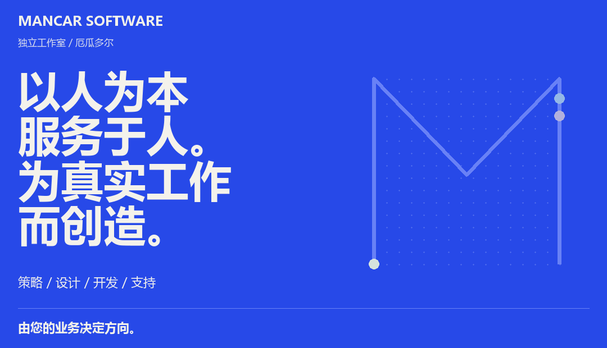
</picture>

# Mancar Software

我们将策略、设计与开发相结合，帮助企业建立信任、简化日常工作，并为未来做好准备。我们位于厄瓜多尔瓜亚基尔，从初次沟通到产品上线和持续支持，始终与企业负责人直接合作。

## 精选项目

### 01 / OdontoCare

<a href="https://github.com/MancarSoftware/odonto_care">
<picture>
  <source media="(prefers-reduced-motion: reduce) and (max-width: 600px)" srcset="assets/zh/project-odontocare-mobile.png" />
  <source media="(prefers-reduced-motion: reduce)" srcset="assets/zh/project-odontocare.png" />
  <source media="(max-width: 600px)" srcset="assets/zh/project-odontocare-mobile.gif" />
  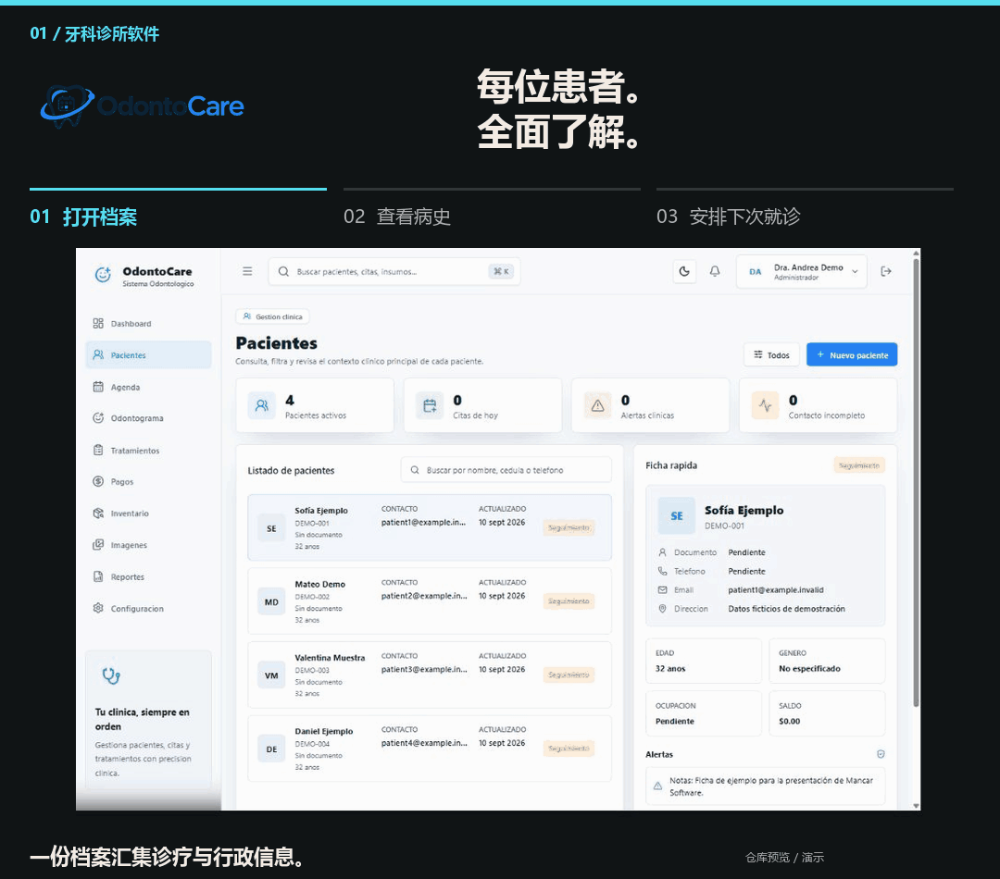
</picture>
</a>

一款支持离线使用的 Windows 应用，用于管理患者档案、预约、治疗和付款。

来自代码仓库的界面截图 · 虚构临床数据 · 原始界面为西班牙语

<a href="https://github.com/MancarSoftware/odonto_care">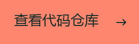</a>

**适用对象：** 希望集中管理诊疗和行政工作的牙科诊所。

**核心功能：** 病史、预约、牙位图、治疗、付款、库存和报表。文档中的流程还涵盖用户角色、审计记录、备份与恢复。

**技术栈：** Electron、React、TypeScript、NestJS、PostgreSQL 和 Prisma。

部署与技术详情

应用可安装于 Windows，采用本地 PostgreSQL 存储。正式安装程序管理所需服务，使诊所能够离线工作。仓库文档说明了关键流程、打包、备份恢复和安装的验证步骤。

功能聚焦：临床病史

**回顾每次就诊的诊疗记录。**

病史视图集中展示患者此前的临床记录，帮助团队在记录新一次就诊之前回顾既往诊疗。

### 02 / VetCare Pro

<a href="https://github.com/MancarSoftware/vetCarePro">
<picture>
  <source media="(prefers-reduced-motion: reduce) and (max-width: 600px)" srcset="assets/zh/project-vetcare-mobile.png" />
  <source media="(prefers-reduced-motion: reduce)" srcset="assets/zh/project-vetcare.png" />
  <source media="(max-width: 600px)" srcset="assets/zh/project-vetcare-mobile.gif" />
  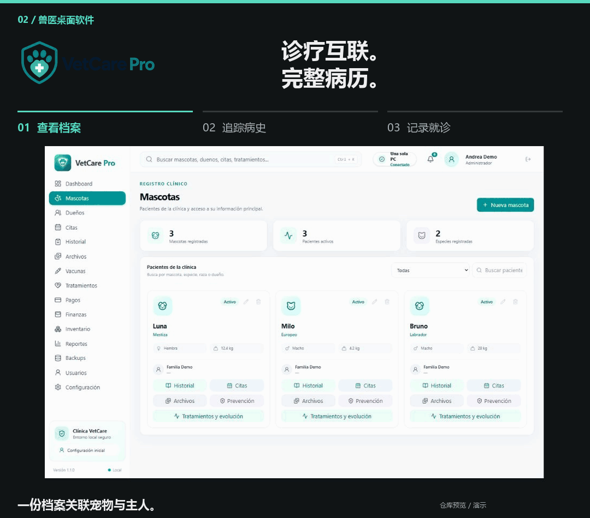
</picture>
</a>

适用于单机和局域网环境的兽医诊所软件，诊所内可共享病历、日程和付款信息。

来自代码仓库的界面截图 · 虚构临床数据 · 原始界面为西班牙语

**适用对象：** 在同一诊所内使用一台或多台电脑的兽医团队。

**核心功能：** 患者档案、病史、预约、疫苗接种、治疗、影像和付款。局域网支持让前台、兽医和收款人员访问同一系统。

**技术栈：** Electron、Node.js 和 PostgreSQL。

部署与技术详情

在 Windows 上支持单机、局域网服务器和客户端模式。一台电脑托管本地服务和数据，其他电脑通过诊所网络连接。此本地工作流程无需互联网。仓库提供安装、网络配置和备份指南。

功能聚焦：共享临床信息

**让病历成为诊疗的核心。**

病史视图保留历次就诊的信息。在文档所述的局域网配置中，诊所电脑共享相同的本地服务与数据。

### 03 / Alma Vet

<a href="https://github.com/MancarSoftware/veterinaria">
<picture>
  <source media="(prefers-reduced-motion: reduce) and (max-width: 600px)" srcset="assets/zh/project-almavet-mobile.png" />
  <source media="(prefers-reduced-motion: reduce)" srcset="assets/zh/project-almavet.png" />
  <source media="(max-width: 600px)" srcset="assets/zh/project-almavet-mobile.gif" />
  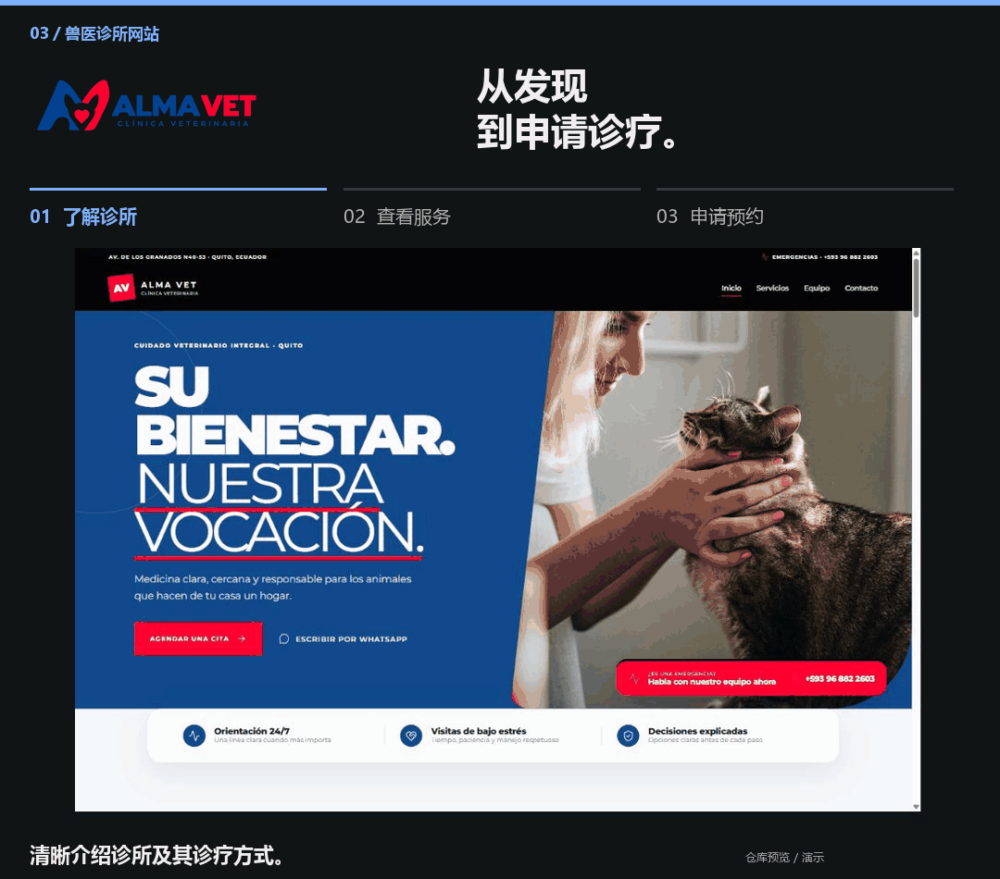
</picture>
</a>

一个兽医诊所网站，引导宠物主人了解服务并提交信息完整的预约申请。

来自代码仓库的界面截图 · 演示内容 · 原始界面为西班牙语

**适用对象：** Alma Vet 诊所及为宠物申请诊疗服务的主人。

**核心功能：** 服务浏览和结构化预约申请，配合服务端验证、机器人防护、申请持久化存储与邮件通知。每份申请均需审核，不会自动确认预约。

**技术栈：** React、Supabase、PostgreSQL、Cloudflare Turnstile 和 Resend。

功能聚焦：预约申请

**提前向诊所提供有用信息。**

申请表收集诊所审核就诊申请所需的信息。提交表单仅代表申请诊疗，不代表预约已确认。

### 04 / Casa Nativa

<a href="https://github.com/MancarSoftware/muebleria">
<picture>
  <source media="(prefers-reduced-motion: reduce) and (max-width: 600px)" srcset="assets/zh/project-casanativa-mobile.png" />
  <source media="(prefers-reduced-motion: reduce)" srcset="assets/zh/project-casanativa.png" />
  <source media="(max-width: 600px)" srcset="assets/zh/project-casanativa-mobile.gif" />
  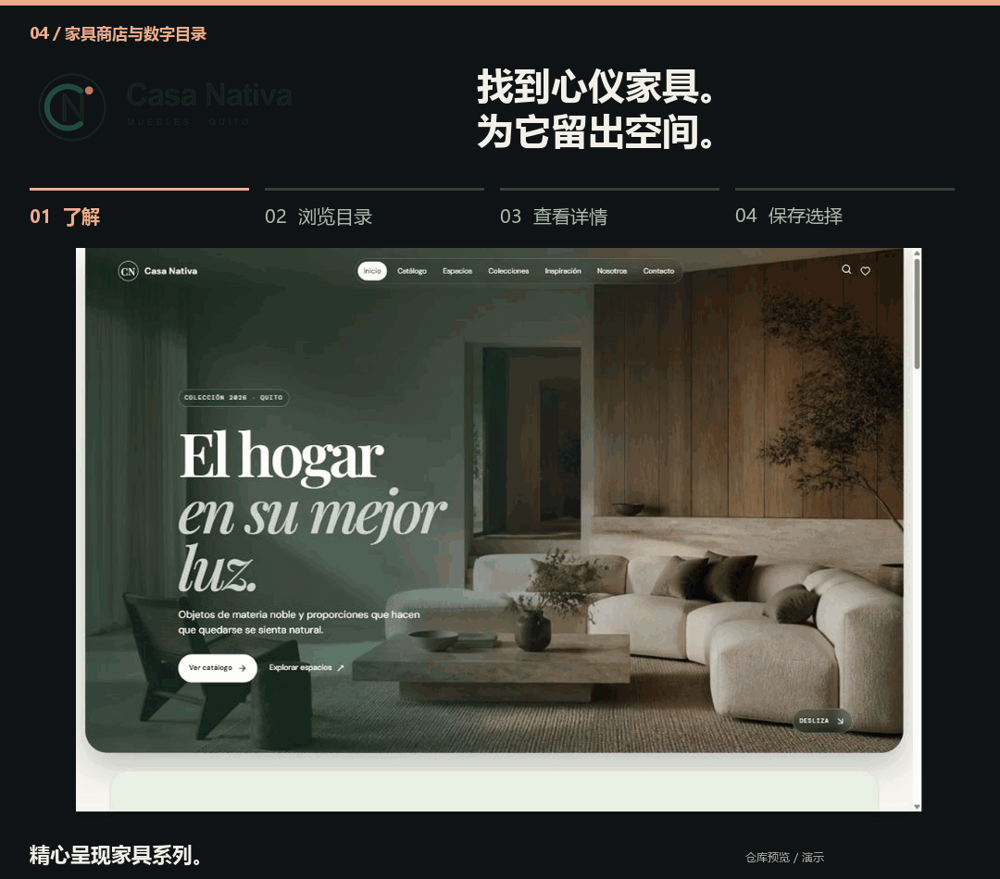
</picture>
</a>

家具零售网站，提供可编辑目录、颜色选项和结构化客户咨询流程。

来自代码仓库的界面截图 · 演示内容 · 原始界面为西班牙语

**适用对象：** Casa Nativa 及为家居选购家具的客户。

**核心功能：** 包含产品图片和颜色选项的家具目录、产品发布管理区，以及空间方案和客户咨询工具。

**技术栈：** React、TypeScript、Vite 和 Supabase。

功能聚焦：已保存的精选

**汇集心仪之选。**

“Mi espacio”（我的空间）汇集已选家具，方便客户在咨询前查看自己的选择。

## 何时与我们合作

<picture>
  <source media="(prefers-reduced-motion: reduce) and (max-width: 600px)" srcset="assets/zh/mancar-starting-points-mobile.png" />
  <source media="(prefers-reduced-motion: reduce)" srcset="assets/zh/mancar-starting-points.png" />
  <source media="(max-width: 600px)" srcset="assets/zh/mancar-starting-points-mobile.gif" />
  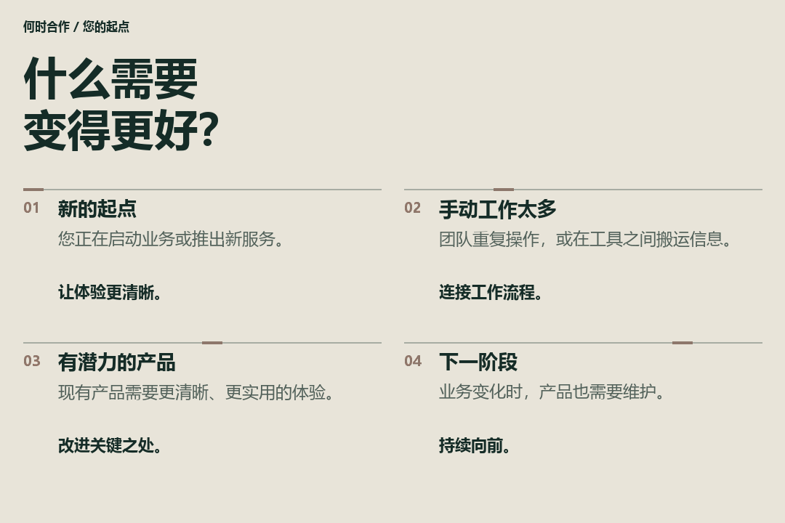
</picture>

无论您正在启动新业务、被重复工作占用太多时间、改进现有产品，还是寻找持续技术支持，我们都会从实际情况出发，一起确定有价值的下一步。

## Mancar 背后的团队

<picture>
  <source media="(prefers-reduced-motion: reduce) and (max-width: 600px)" srcset="assets/zh/mancar-team-mobile.png" />
  <source media="(prefers-reduced-motion: reduce)" srcset="assets/zh/mancar-team.png" />
  <source media="(max-width: 600px)" srcset="assets/zh/mancar-team-mobile.gif" />
  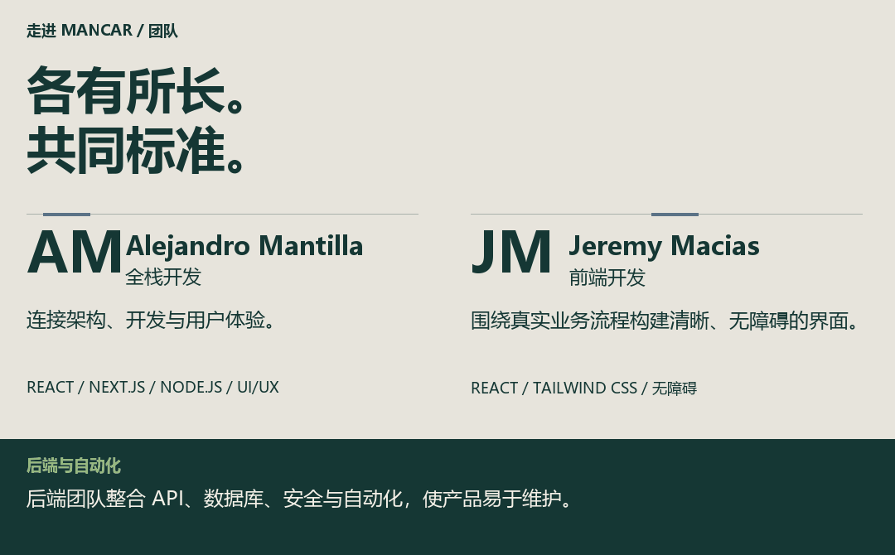
</picture>

Mancar 汇聚全栈开发、前端设计实现和后端工程能力。Alejandro Mantilla 将技术架构与用户体验相连；Jeremy Macias 将业务流程转化为清晰、易用且无障碍的界面。后端团队开发支撑产品的服务和自动化功能。

## 汇聚专业能力

<picture>
  <source media="(prefers-reduced-motion: reduce) and (max-width: 600px)" srcset="assets/zh/mancar-disciplines-mobile.png" />
  <source media="(prefers-reduced-motion: reduce)" srcset="assets/zh/mancar-disciplines.png" />
  <source media="(max-width: 600px)" srcset="assets/zh/mancar-disciplines-mobile.gif" />
  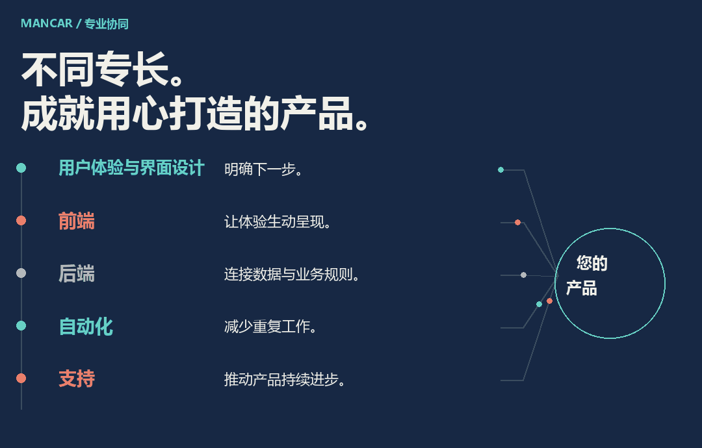
</picture>

用户体验与界面设计、前端开发、后端工程、自动化和支持服务共同服务于一个目标：让产品适合业务，也让使用者容易理解。我们按项目需要整合专业能力，使体验与技术决策相互衔接。

## 我们的工作方式

<picture>
  <source media="(prefers-reduced-motion: reduce) and (max-width: 600px)" srcset="assets/zh/mancar-approach-mobile.png" />
  <source media="(prefers-reduced-motion: reduce)" srcset="assets/zh/mancar-approach.png" />
  <source media="(max-width: 600px)" srcset="assets/zh/mancar-approach-mobile.gif" />
  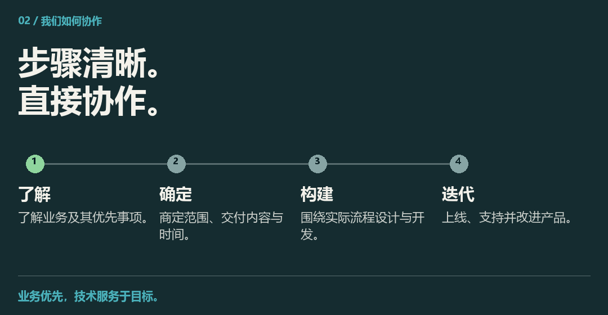
</picture>

开发前先商定范围、优先级和时间安排，再按清晰可见的阶段推进。设计质量、性能、安全性和可维护性贯穿上线及后续维护。

我们根据工作流程选择技术，在需要持续运行时采用本地或局域网方案。

## 项目详解：Casa Nativa

<picture>
  <source media="(prefers-reduced-motion: reduce) and (max-width: 600px)" srcset="assets/zh/mancar-casa-story-mobile.png" />
  <source media="(prefers-reduced-motion: reduce)" srcset="assets/zh/mancar-casa-story.png" />
  <source media="(max-width: 600px)" srcset="assets/zh/mancar-casa-story-mobile.gif" />
  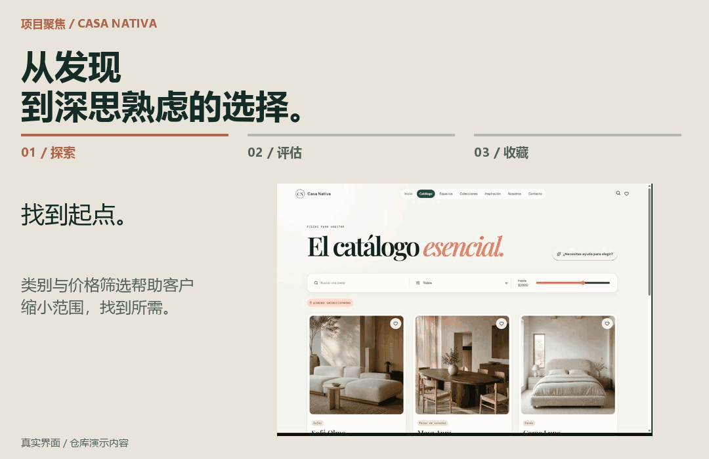
</picture>

家具客户需要的不只是产品名称，还需要足够的信息来判断家具是否适合自己的家。Casa Nativa 将浏览、产品信息和已保存的选择整合为连贯体验。

**客户任务：** 缩小选择范围，了解家具是否适合空间。

**界面设计决策：** 将图片与尺寸、材质和颜色选项放在一起，并通过目录筛选帮助发现产品。

**实现的功能：** 客户可以浏览目录、查看产品，并在咨询前将家具保存到“Mi espacio”。

来自代码仓库的界面截图 · 演示内容 · 原始界面为西班牙语

<a href="https://github.com/MancarSoftware/muebleria">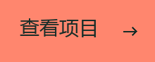</a>

## 上线之后

<picture>
  <source media="(prefers-reduced-motion: reduce) and (max-width: 600px)" srcset="assets/zh/mancar-support-mobile.png" />
  <source media="(prefers-reduced-motion: reduce)" srcset="assets/zh/mancar-support.png" />
  <source media="(max-width: 600px)" srcset="assets/zh/mancar-support-mobile.gif" />
  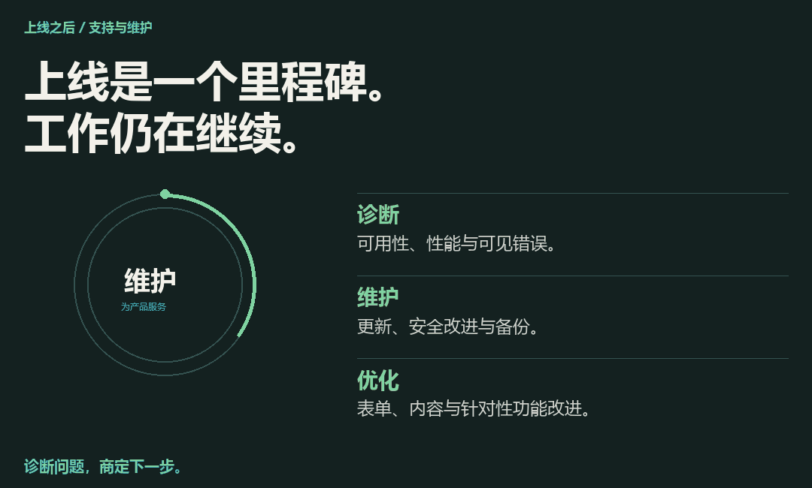
</picture>

业务变化时，产品也需要持续关注。我们的支持涵盖可用性与性能问题、表单提交与邮件送达、更新、备份，以及内容或功能的针对性改进。

改动前先了解情况，优先处理影响销售、表单或可用性的问题。诊断后再商定处理范围与后续步骤。

**支持时间：** 周一至周五，厄瓜多尔时间 9:00–18:00（UTC−5）。

## 联系我们之后会怎样？

<picture>
  <source media="(prefers-reduced-motion: reduce) and (max-width: 600px)" srcset="assets/zh/mancar-first-conversation-mobile.png" />
  <source media="(prefers-reduced-motion: reduce)" srcset="assets/zh/mancar-first-conversation.png" />
  <source media="(max-width: 600px)" srcset="assets/zh/mancar-first-conversation-mobile.gif" />
  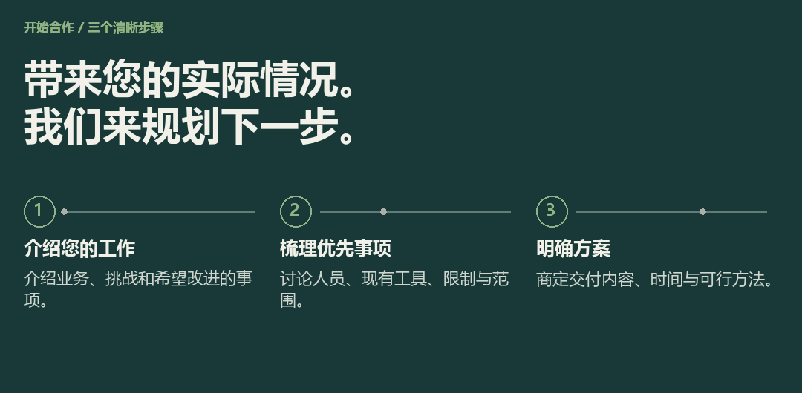
</picture>

请带来一个业务挑战、现有产品，或希望改进事项的简单示例。我们将据此评估工作并制定切实可行的方案。

## 与我们合作

能否改进现有产品？

可以。我们会先了解当前体验、工作流程和技术情况，再建议有针对性的改进。

联系前需要准备什么？

简要介绍业务、希望解决的问题和优先事项即可开始。如有现有产品或示例，也可以一并提供；无需准备技术规格说明。

如何安排持续支持？

我们先评估问题及其影响，再商定处理方式和后续步骤。支持可涵盖可用性、性能、表单、更新、备份或针对性改进。请联系我们，讨论产品所需的支持范围。

## 开启对话

<picture>
  <source media="(prefers-reduced-motion: reduce) and (max-width: 600px)" srcset="assets/zh/mancar-contact-mobile.png" />
  <source media="(prefers-reduced-motion: reduce)" srcset="assets/zh/mancar-contact.png" />
  <source media="(max-width: 600px)" srcset="assets/zh/mancar-contact-mobile.gif" />
  
</picture>

<a href="https://ale-mancar.github.io/mancar_software/">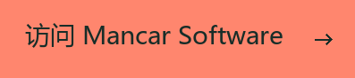</a>

MANCAR SOFTWARE · 厄瓜多尔瓜亚基尔
